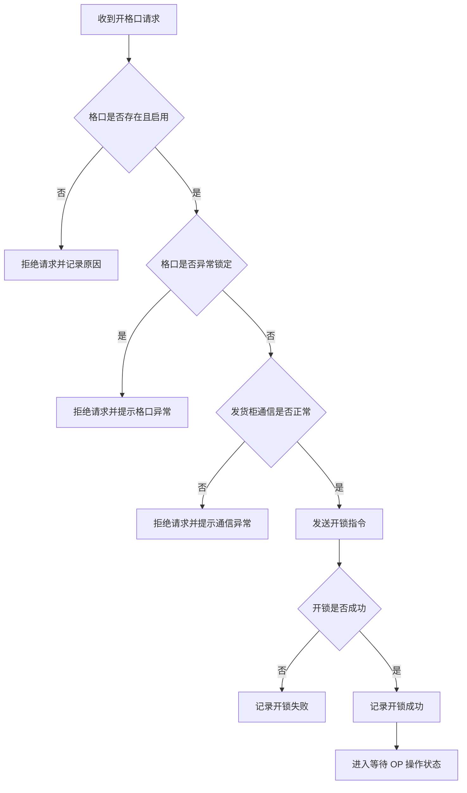
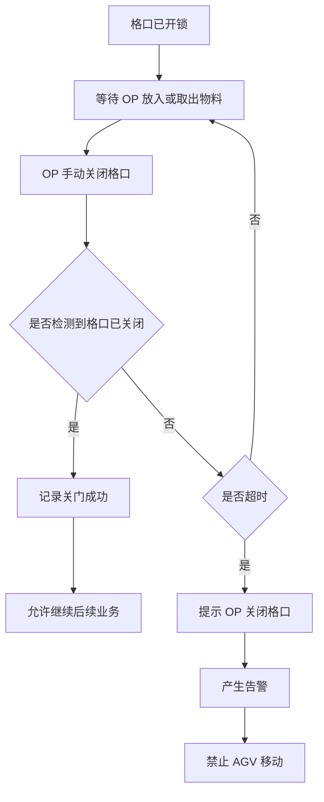
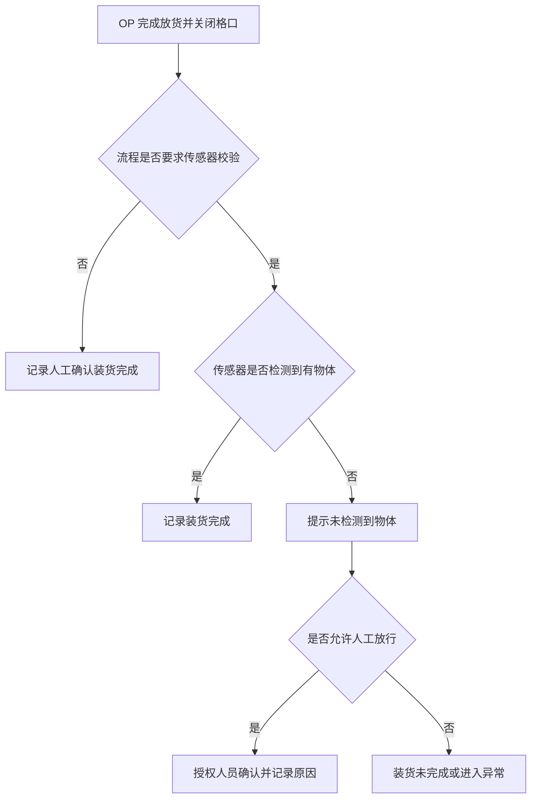
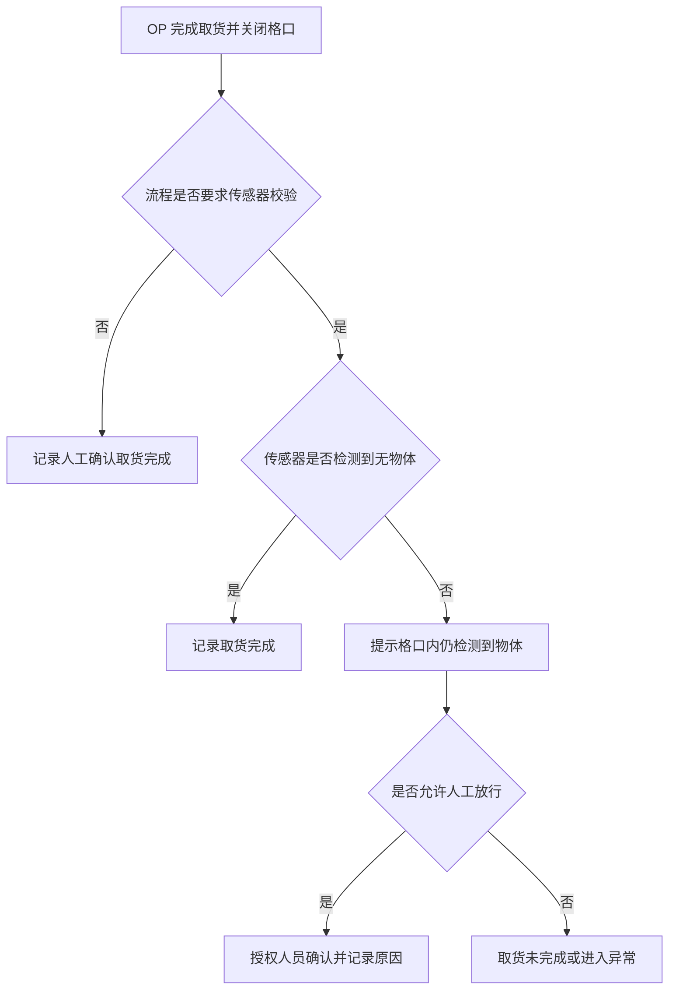

# 格口控制层 Slot Control Layer

## 1. 文档说明

### 1.1 文档目的

格口控制层负责统一管理当前发货柜的所有格口，并向上层业务提供基于格口编号的控制与状态查询能力。

格口控制层应支持对指定单个格口执行开锁、状态查询、传感器读取、异常锁定等操作，也应支持批量读取所有格口状态，用于界面展示、安全联锁(Fault Interlock)和任务调度判断。

本文档用于说明格口控制层在需求阶段需要具备的业务能力、状态定义、操作规则、异常处理和日志追溯要求，不描述具体硬件通信协议、报文格式、轮询周期或代码实现方式。

### 1.2 职责边界

格口控制层负责“格口能力抽象”和“格口状态管理”，但不直接决定某个业务场景是否允许开门。

是否允许开门应由站点作业层根据任务、站点、OP 权限、物料规则、MES 校验和安全联锁规则综合判断。格口控制层只负责执行被授权的格口控制请求，并返回执行结果。

简单来说：

- 站点作业层决定“能不能开”。
- 格口控制层负责“打开指定格口，并确认状态”。
- 发货柜硬件控制器负责“实际驱动电子锁和传感器”。

## 2. 控制对象

### 2.1 格口 Slot

格口是发货柜中的独立存取单元，每个格口至少包含：

- 格口编号
- 所属发货柜
- 物理位置信息，例如前侧/后侧、行号、列号、显示顺序
- 显示名称，用于 HMI 或远程界面展示
- 电子锁开锁能力，必须配置
- 锁状态反馈或门状态反馈，至少提供一种，也可全部提供
- 可选物体检测传感器
- 启用/禁用状态

一个发货柜包含多个格口。不同发货柜型号的格口数量可以不同，系统不得写死格口数量。

格口属于发货柜，发货柜属于复合机器人。当前阶段，一个复合机器人默认挂载一个发货柜；若后续支持一个复合机器人挂载多个发货柜，可通过发货柜编号区分不同柜体，格口仍归属于具体发货柜。

格口编号可根据物理位置信息按统一规则生成。例如可根据发货柜侧别、行号和列号生成内部编号，并根据前后侧、从上到下、从左到右等规则生成显示顺序。

格口编号一旦用于任务、库存、日志或追溯数据后，应保持稳定。若后续柜体布局或编号规则发生变化，应通过配置变更或数据迁移处理，不应随运行时位置变化自动改变历史业务编号。

#### 2.1.1 电子锁 Lock

电子锁是格口的开锁执行部件。

每个格口必须具备电子锁开锁能力。系统应支持向指定格口发送开锁请求，并基于可用反馈确认开锁执行结果。

格口硬件至少应提供锁状态反馈或门状态反馈中的一种，用于系统判断开锁、关门确认和异常处理。若硬件同时提供锁状态反馈和门状态反馈，系统应同时接入并综合判断格口状态。

需要注意：通常情况下，系统只能控制“开锁”，不能主动“关门”。关门动作由 OP 手动完成，系统负责确认格口是否已关闭或锁状态是否恢复正常。

#### 2.1.2 锁状态反馈 Lock Status Feedback

锁状态反馈表示电子锁或锁控模块返回的锁机构相关反馈，用于判断锁是否已释放或是否已锁住。锁状态反馈关注的是锁机构本身，不等同于门是否已经被 OP 打开或关闭。

系统不得假设多个格口共用同一锁状态反馈。

需要注意：电子锁或锁控模块通常不会直接反馈“锁异常”或“状态未知”等结论。锁异常、状态未知等状态应由系统根据开锁结果、反馈变化、超时、通信状态以及前后状态是否一致进行判断。

锁状态反馈至少用于：

- 判断开锁指令是否执行成功。
- 判断 OP 关门后锁是否恢复到已锁状态。
- 辅助系统判断锁机构是否存在异常或状态未知。
- 辅助判断格口是否允许继续参与任务或是否需要异常锁定。

例如，开锁成功后可能出现“锁状态已开，但门状态仍为已关闭”，表示锁已释放但 OP 尚未打开门；关门后若“门状态已关闭，但锁状态未恢复已锁”，则表示门虽然合上但锁未可靠锁住，应提示异常或等待处理。

#### 2.1.3 门状态 Door Status

如果硬件支持门状态检测，系统应支持读取格口门状态。

当前公司所有格口均未配备独立门状态检测装置，因此现阶段无法直接提供门打开或门关闭信息。门状态检测作为可选扩展能力保留，后续若硬件增加门磁、行程开关或其他门状态检测装置，系统应支持接入并读取门状态。

门状态用于判断：

- OP 是否已经打开格口。
- OP 是否已经关闭格口。
- 格口未关闭时是否禁止 AGV 移动。
- 是否发生关门超时。

如果硬件不支持独立门状态检测，系统可使用电子锁状态或其他硬件反馈作为替代依据，但应在后续硬件接口设计中明确。

#### 2.1.4 物体检测传感器 Object Sensor

物体检测传感器为可选能力，不同机型或不同格口可能配置，也可能不配置。已配置传感器的格口可用于判断格口内是否存在物体。

传感器可用于：

- 装货后确认格口内有物体。
- 取货后确认格口内无物体。
- 辅助判断 OP 是否完成存取操作。
- 辅助发现格口状态异常。

是否必须使用传感器结果完成业务确认，应由流程模板决定。

需要注意：物体检测传感器不一定能稳定检测所有物品。当放入物品尺寸过小、位置偏移或传感器检测范围不覆盖时，可能出现无法检测到物体的情况。因此传感器结果应作为流程确认依据之一，是否强制依赖传感器确认应由流程模板决定，并允许按权限进行人工确认或异常处理。

#### 2.1.5 启用/禁用状态 Enable/Disable Status

格口启用/禁用状态表示单个格口在业务上的可用性，用于控制该格口是否允许参与任务分配和普通业务操作。

格口启用时，表示该格口可在满足业务规则、硬件状态和安全联锁条件的情况下参与装货、取货、开锁和状态查询等操作。

格口禁用时，表示该格口暂时不参与普通业务。禁用原因可能包括格口硬件故障、锁机构异常、传感器异常、现场维护、配置未完成、人工临时停用或安全风险未解除。

格口被禁用后：

- 不应参与自动格口分配。
- 不应允许普通业务开格口。
- 不应作为可用格口返回给上层业务。
- 仍应允许管理员或维护人员按权限查看状态、处理异常或重新启用。

格口启用/禁用状态是软件管理状态，不等同于锁状态、门状态或传感器状态。即使格口硬件反馈正常，系统也可以因为业务或维护原因将该格口禁用；反之，格口配置为启用并不代表当前一定可操作，仍需结合发货柜通信状态、格口硬件状态、业务占用状态和异常锁定状态综合判断。

### 2.2 发货柜 Cabinet

发货柜是格口的容器，并归属于复合机器人。格口控制层管理当前发货柜下的全部格口。

发货柜至少包含：

- 发货柜编号。
- 所属复合机器人编号。
- 发货柜型号。
- 格口数量。
- 发货柜通信状态。
- 启用/禁用状态。

#### 2.2.1 发货柜编号 Cabinet ID

发货柜编号用于唯一标识一台实际发货柜。系统在查询发货柜、查询格口、打开格口、记录日志和追溯异常时，应能够通过发货柜编号定位到具体柜体。

在当前一台复合机器人默认挂载一个发货柜的场景下，发货柜编号可以与复合机器人形成一一绑定关系。若后续支持一台复合机器人挂载多个发货柜，则必须通过发货柜编号区分同一复合机器人上的不同柜体。

#### 2.2.2 所属复合机器人编号 Robot ID

所属复合机器人编号表示该发货柜当前归属于哪一台复合机器人。格口控制层可通过复合机器人编号找到其挂载的发货柜，再通过发货柜编号和格口编号定位到具体格口。

该信息用于任务调度、站点作业、AGV 离站判断、日志追溯和维护定位。当前阶段，一个复合机器人默认挂载一个发货柜；后续若支持一车多柜，该关系可扩展为一个复合机器人对应多个发货柜。

#### 2.2.3 发货柜型号 Cabinet Model

发货柜型号用于描述一类发货柜的固定结构和默认配置。发货柜型号应定义默认格口数量、物理布局、编号生成规则以及可选硬件能力，例如是否支持门状态检测、哪些格口配置物体检测传感器等。

实际发货柜实例应关联一个发货柜型号，并可基于型号默认配置生成或维护格口配置。实际发货柜仍应允许根据现场情况维护启用/禁用状态、通信状态，以及单个格口的启用/禁用、异常锁定或传感器配置差异。

不同发货柜型号的格口数量和布局可以不同，系统不得写死格口数量，也不应假设所有发货柜具有相同的格口布局。

#### 2.2.4 格口数量 Slot Count

格口数量表示当前发货柜包含的格口总数。格口数量通常由发货柜型号的默认布局决定，也可以在实际发货柜配置中进行校验或维护。

系统应根据发货柜型号和实际配置管理格口数量，不应在业务流程、界面展示或控制逻辑中写死固定数量。查询所有格口、批量刷新状态、HMI 布局展示和格口分配都应基于当前发货柜的实际格口配置。

#### 2.2.5 发货柜通信状态 Cabinet Communication Status

发货柜通信状态表示系统与发货柜硬件控制器之间的通信是否正常。格口开锁、锁状态读取、门状态读取和传感器读取都依赖发货柜硬件控制器完成，因此通信状态会影响格口控制请求是否可以执行，以及格口状态是否可信。

发货柜通信状态建议包括：

- 正常：系统可以正常向发货柜硬件控制器下发控制指令并读取状态。
- 超时：系统已发送请求，但未在规定时间内收到有效响应。
- 离线：系统无法连接或无法访问发货柜硬件控制器。
- 未配置：当前发货柜尚未配置硬件控制器或通信参数。

当发货柜通信异常时，系统应拒绝普通开格口请求，提示通信异常，并避免继续依赖该发货柜的实时硬件状态进行任务判断。通信异常也应作为安全联锁和异常处理的判断依据。

发货柜控制器通信异常时，系统可保留最后一次成功读取到的格口状态，用于 HMI 展示、日志追溯和故障分析。但该状态必须标记为非实时或不可信，不得作为开格口、任务继续或 AGV 移动放行的唯一依据。

#### 2.2.6 启用/禁用状态 Enable/Disable Status

发货柜启用/禁用状态表示发货柜在业务上的可用性，不等同于通信状态。发货柜即使通信正常，也可能因为维护、故障隔离、配置未完成或安全原因被管理员禁用。

发货柜被禁用后：

- 不应参与普通任务分配。
- 不应允许普通业务开格口。
- 不应作为可用发货柜参与调度判断。
- 管理员或维护人员仍可按权限查看状态、执行维护或解除禁用。

发货柜通信状态与启用/禁用状态组合后的业务含义如下：

- 通信正常且启用：发货柜可正常参与业务使用。
- 通信正常但禁用：系统可以连接发货柜，但人为或配置上不允许普通业务使用。
- 通信异常但启用：配置上允许使用，但当前无法可靠控制或读取状态，应阻止普通操作并提示异常。
- 通信异常且禁用：发货柜处于停用状态，且当前无法可靠通信，应等待维护或重新配置。

## 3. 控制能力需求

### 3.1 单格口控制能力

格口控制层应支持对指定格口执行以下操作：

- 打开指定格口。
- 查询指定格口锁状态。
- 查询指定格口门状态，如果硬件支持。
- 查询指定格口物体检测状态，如果该格口配置传感器。
- 将指定格口标记为异常锁定。
- 清除指定格口异常锁定，需授权。
- 禁用指定格口。
- 启用指定格口。

### 3.2 发货柜查询能力

格口控制层应支持按发货柜维度查询基础信息和布局信息，用于站点作业、HMI 展示、配置校验和任务判断。

至少包括：

- 查询发货柜基础信息，包括发货柜编号、所属复合机器人编号、发货柜型号、格口数量、通信状态和启用/禁用状态。
- 查询发货柜型号和格口布局，用于 HMI 展示、格口编号生成、格口排序和配置校验。
- 查询发货柜当前是否可参与业务。

发货柜是否可参与业务应综合考虑发货柜启用状态、通信状态、配置完整性以及是否存在阻止业务的整体异常。

### 3.3 格口查询与筛选能力

格口控制层应支持按发货柜维度查询和筛选格口，用于界面展示、格口分配、维护检查和异常处理。

至少包括：

- 查询当前发货柜所有格口。
- 查询某个指定格口。
- 查询所有可用格口。
- 查询所有空闲格口。
- 查询所有已占用格口。
- 查询所有正在操作中的格口。
- 查询所有异常格口。
- 查询所有禁用格口。

查询当前发货柜所有格口时，应返回格口编号、物理位置、显示名称、启用状态、业务状态和硬件状态等信息。

发货柜控制器应支持批量读取格口状态，当前可通过 Modbus 批量读取方式获取多个格口的状态数据。具体 Modbus 地址、寄存器定义和读取策略应在硬件接口设计文档中定义。

查询某个指定格口时，上层业务可用于确认格口是否存在、是否启用、是否异常锁定以及当前状态是否允许操作。

### 3.4 安全联锁判断能力

格口控制层应支持向上层提供安全联锁判断结果，用于站点作业结束判断和 AGV 是否允许离站。

至少包括：

- 判断是否存在未关闭格口。
- 判断是否存在正在操作中的格口。
- 判断是否存在状态异常的格口。
- 判断是否存在阻止 AGV 移动的格口状态或发货柜异常。

格口控制层应支持持续监测格口状态，并在格口状态变化时更新安全联锁判断结果。格口打开、疑似未关闭、开锁后未完成确认、格口操作未完成、状态异常或发货柜通信异常，均应作为可能影响 AGV 移动的联锁条件。

格口是否处于打开或疑似未关闭状态，可根据硬件实际配置进行判断。若硬件提供门状态反馈，应优先使用门状态判断门是否打开或关闭；若硬件未提供门状态反馈，可根据锁状态反馈、开锁操作状态、操作流程是否完成、超时和人工确认结果进行判断；若锁状态反馈和门状态反馈均提供，系统应综合两类反馈判断。

机器人任务层可基于该判断决定是否允许复合机器人离开当前站点或执行下一步移动。

### 3.5 格口状态同步

系统启动、发货柜重新连接、任务恢复或异常处理后，格口控制层应支持重新同步格口状态。

状态同步至少包括：

- 同步发货柜通信状态。
- 同步电子锁状态。
- 同步门状态，如果硬件支持。
- 同步传感器状态，如果配置传感器。
- 同步软件侧格口业务状态。

如果硬件状态和软件业务状态不一致，系统应提示异常并等待人工确认或重新校验。

通信异常恢复后，格口控制层应重新同步发货柜和格口状态。同步完成前，最后一次成功读取的状态不得直接恢复为可信状态，也不得用于安全放行判断。

## 4. 状态定义

### 4.1 硬件状态

硬件状态表示格口硬件反馈结果，不等同于业务状态。

电子锁状态建议包括：

- 已锁。
- 已开。
- 锁异常。
- 状态未知。

门状态建议包括：

- 已关闭。
- 已打开。
- 门状态异常。
- 状态未知。

传感器状态建议包括：

- 有物体。
- 无物体。
- 传感器异常。
- 状态未知。

通信状态建议包括：

- 正常。
- 超时。
- 离线。
- 未配置。

### 4.2 业务状态

业务状态表示格口在业务流程中的使用状态。

格口业务状态建议包括：

- 空闲：格口未被任务占用，可被分配。
- 已预占：格口已被任务或作业预占，但尚未完成装货。
- 待装货：格口等待 OP 装入物料。
- 装货中：格口正在执行装货相关操作。
- 已装货：格口已完成装货，等待运输或取货。
- 运输中：格口内物料随 AGV 移动中。
- 待取货：格口到达目标站点，等待 OP 取货。
- 取货中：格口正在执行取货相关操作。
- 已取货：格口已完成取货，等待释放。
- 异常锁定：格口因异常被锁定，普通业务不得继续使用。
- 禁用：格口被管理员禁用，不参与任务分配。

### 4.3 硬件状态与业务状态的关系

硬件状态和业务状态必须分开管理。

示例：

- 一个格口的硬件锁状态可以是“已锁”，业务状态可以是“已装货”。
- 一个格口的传感器状态可以是“有物体”，业务状态可以是“待取货”。
- 一个格口的门状态是“已打开”时，业务状态可能是“装货中”或“取货中”。

系统不得只根据单一硬件状态推断完整业务状态。

## 5. 开格口流程需求

### 5.1 开格口前置校验

格口控制层接收开格口请求前，上层业务应完成业务校验。

开格口请求至少应包含：

- 请求来源。
- 操作人。
- 任务编号或作业会话编号。
- 发货柜编号。
- 格口编号。
- 操作类型，例如装货、取货、维护、异常处理。

格口控制层在执行前仍应检查基础条件：

- 格口存在。
- 格口已启用。
- 格口未处于异常锁定。
- 发货柜通信正常。
- 当前无同一格口的并发操作。

### 5.2 开格口正常流程

### 5.3 开格口失败处理

开格口失败时，系统应：

- 记录开锁失败原因。
- 提示 OP 或上层业务开锁失败。
- 按配置判断是否允许重试。
- 多次失败后将格口标记为异常锁定。
- 阻止该格口继续参与普通业务。

当前硬件不会直接返回细分的开锁失败错误类型。系统应根据开锁指令执行结果、锁状态反馈变化、通信状态、超时和前后状态一致性判断开锁是否失败，并记录系统侧判定原因。

## 6. 关门确认流程需求

### 6.1 关门确认原则

系统通常不主动关闭格口。OP 完成装货或取货后，应手动关闭格口，系统负责确认格口已关闭。

格口关闭状态可根据锁状态反馈或门状态反馈进行判断。当前公司现有机型主要依赖锁状态反馈确认格口是否恢复到已锁状态；若后续机型配置门状态检测装置，系统也可基于门状态判断门是否关闭。若同时具备锁状态反馈和门状态反馈，系统应综合两类反馈判断，并在反馈不一致时进入异常或人工确认流程。

格口未确认关闭前：

- 当前格口操作不得完成。
- 相关站点作业不得正常结束。
- AGV 不得离开当前站点。
- 不得下发新的移动指令。

### 6.2 关门确认流程

### 6.3 关门超时处理

关门超时时，系统应：

- 在柜端 HMI 显示提示。
- 在远程操作端显示告警。
- 记录超时日志。
- 禁止 AGV 移动。
- 允许授权人员处理异常。

## 7. 传感器确认流程需求

### 7.1 装货确认

如果流程模板要求装货后使用传感器确认，则系统应在 OP 放货并关闭格口后读取传感器状态。

### 7.2 取货确认

如果流程模板要求取货后使用传感器确认，则系统应在 OP 取货并关闭格口后读取传感器状态。

### 7.3 传感器异常

传感器异常时，系统应根据流程模板处理：

- 如果流程要求强校验，任务或作业应进入异常。
- 如果流程允许人工确认，授权人员可确认后继续。
- 所有人工确认都必须记录操作人、时间和原因。

## 8. 异常处理需求

### 8.1 异常类型

格口控制层应识别或承接以下异常：

- 格口不存在。
- 格口已禁用。
- 格口异常锁定。
- 开锁失败。
- 锁状态未知。
- 门状态未知。
- 关门超时。
- 传感器异常。
- 发货柜通信异常。
- 同一格口存在并发操作。
- 软件业务状态与硬件状态不一致。

### 8.2 异常锁定

当格口发生严重异常时，系统应支持将格口标记为异常锁定。

异常锁定后：

- 普通 OP 不得使用该格口。
- 该格口不得参与自动分配。
- 该格口不得执行普通开锁操作。
- 管理员或主管可按权限查看和处理。

### 8.3 异常解除

解除异常锁定应满足：

- 操作人具备权限。
- 已确认异常原因。
- 已确认格口硬件状态可用。
- 需由管理员确认，可通过管理端、密码校验或其他授权方式完成。
- 系统记录解除原因和处理结果。

### 8.4 管理员远程强制开格口

系统应支持管理员远程强制开格口能力，用于维护、异常处理或授权放行场景。

远程强制开格口应满足：

- 操作人具备管理员或等效授权权限。
- 系统记录强制开格口原因。
- 当前格口和发货柜处于可安全开门的状态。
- 强制开格口不会违反安全联锁要求。
- 操作过程应记录日志，包含操作人、时间、发货柜编号、格口编号、原因和执行结果。

若格口门或锁状态无法确认，或当前状态不满足安全开启条件，系统不得仅因管理员远程请求而直接开格口，应进入人工确认或现场处理流程。

## 9. 安全联锁需求

格口控制层应向上层提供安全联锁判断所需状态。

至少支持判断：

- 是否存在已打开格口。
- 是否存在未确认关闭格口。
- 是否存在正在进行中的格口操作。
- 是否存在阻止 AGV 移动的格口异常。
- 是否存在发货柜通信异常。

当存在未关闭格口、格口操作进行中或阻止移动的异常时，系统不得允许 AGV 离开当前站点。

在 AGV 移动过程中，系统应持续监测格口相关安全状态。若检测到格口打开、疑似未关闭、开锁后未完成确认、格口操作未完成、格口状态异常或发货柜通信异常，格口控制层应立即将安全联锁状态置为不允许移动，并通知机器人任务层或运动控制相关模块。

机器人任务层或运动控制相关模块收到不允许移动的联锁状态后，应停止当前移动或禁止继续下发移动指令，并保持等待处理状态，直到格口状态恢复正常、异常解除，并重新确认安全联锁状态允许移动。

格口打开或未关闭状态的判断依据应与硬件配置匹配。若配置门状态反馈，应基于门状态判断；若未配置门状态反馈，应基于锁状态反馈、开锁操作状态、操作流程完成情况、超时和人工确认结果进行判断；若同时配置门状态反馈和锁状态反馈，应综合判断，并在两类反馈不一致时进入异常或人工确认流程。

## 10. 日志与追溯需求

格口控制层应记录所有关键操作。

至少包括：

- 开格口请求。
- 开格口结果。
- 关门确认结果。
- 传感器读取结果。
- 格口状态变化。
- 格口异常产生。
- 格口异常解除。
- 格口禁用或启用。
- 人工确认或授权放行。

日志应记录：

- 操作时间。
- 操作人。
- 请求来源。
- 发货柜编号。
- 格口编号。
- 关联任务编号。
- 关联站点作业会话编号。
- 操作类型。
- 执行结果。
- 异常原因。

## 11. 与上层业务的关系

### 11.1 与站点作业层的关系

站点作业层负责处理 OP 的装货、取货、扫码、身份认证、MES 校验和作业确认。

站点作业层在判断允许操作格口后，调用格口控制层执行格口控制。

### 11.2 与机器人任务层的关系

机器人任务层负责 AGV 到站、等待作业、离开站点或去充电。

格口控制层不直接控制机器人移动，但格口状态会影响机器人是否允许移动。

例如：

- 有格口未关闭时，机器人不得离开站点。
- 有格口操作进行中时，机器人不得执行下一次移动。
- 有阻止移动的格口异常时，机器人任务应等待人工处理。

### 11.3 与发货柜硬件控制器的关系

格口控制层通过发货柜硬件控制器完成实际开锁、状态读取和传感器读取。

具体硬件协议、接口地址、报文格式、状态码和重试策略应在后续接口设计或硬件控制设计文档中定义。
