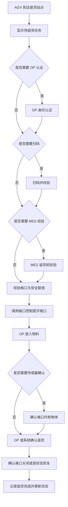
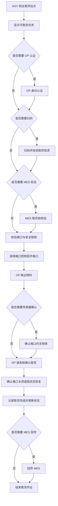

# 站点作业层 Station Operation Layer

## 1. 文档说明

### 1.1 文档目的

站点作业层负责管理复合机器人到达固定站点后的人工作业过程，并根据任务、站点、OP 权限、物料规则、流程模板、MES 校验和安全联锁状态，决定当前站点是否允许执行装货、取货、确认、放行或异常处理。

站点作业层应向上衔接任务管理、流程模板、MES/RCS 交互结果，向下调用格口控制层执行指定格口开锁、状态查询和安全联锁判断。

本文档用于说明站点作业层在需求阶段需要具备的业务能力、对象定义、流程规则、校验规则、异常处理和日志追溯要求，不描述具体前端界面实现、通信协议、接口报文格式或代码实现方式。

### 1.2 职责边界

站点作业层负责“到站后的人工作业编排”和“开格口前业务授权判断”。

简单来说：

- 任务管理层负责“有什么任务、任务当前到哪一步”。
- 机器人任务层负责“AGV 去哪里、是否到站、是否允许离站”。
- 站点作业层负责“当前站点能不能装货/取货，OP 需要做什么，能不能打开某个格口”。
- 格口控制层负责“打开指定格口，并返回格口状态和控制结果”。
- 发货柜硬件控制器负责“实际驱动电子锁、读取传感器或硬件反馈”。

站点作业层不直接控制 AGV 行驶，也不直接驱动电子锁。站点作业层只在业务校验通过后调用对应下层能力。

## 2. 控制对象

### 2.1 站点 Station

站点是复合机器人可以到达并执行作业的固定位置。

站点至少包含：

- 站点编号。
- 站点名称。
- RCS 站点编码。
- 站点类型。
- 启用/禁用状态。
- 是否允许装货。
- 是否允许取货。
- 是否允许等待。

站点类型可包括：

- 装货站点。
- 取货站点。
- 等待站点。
- 异常处理站点。
- 充电或停靠站点。

站点作业层应基于 AGV 当前站点判断任务是否允许在当前位置继续执行。若当前站点与任务要求站点不一致，普通业务不得打开格口或完成作业。

### 2.2 站点作业会话 Station Operation Session

站点作业会话表示一次 AGV 到站后围绕某个任务或一组任务执行的人工作业过程。

站点作业会话至少包含：

- 作业会话编号。
- 关联任务编号。
- 当前复合机器人编号。
- 当前发货柜编号。
- 当前站点编号。
- 作业类型，例如装货、取货、等待、异常处理。
- 当前作业状态。
- 当前操作 OP。
- 开始时间和结束时间。

站点作业会话用于记录 OP 在某个站点对某个任务执行了哪些操作，包括身份认证、扫码、格口开锁、装货确认、取货确认、人工放行和异常处理。

### 2.3 OP 操作员

OP 是在站点执行装货、取货、扫码、确认和部分异常处理的现场操作人员。

站点作业层应支持根据流程模板判断当前作业是否需要 OP 身份认证。

OP 信息至少包括：

- OP 编号。
- OP 名称。
- 班组或部门。
- 权限角色。
- 当前认证状态。

当流程要求绑定存货 OP 或领货 OP 时，站点作业层应记录实际操作人，并在后续取货或追溯时进行校验。

### 2.4 作业任务 Operation Task

作业任务是站点作业层执行装货或取货的业务依据。

站点作业层不负责创建任务，但应读取并校验任务信息。

站点作业层至少需要使用以下任务信息：

- 任务编号。
- 任务来源，例如 MES 或人工创建。
- 任务类型，例如装货、取货、配送、退回。
- 起始站点。
- 目标站点。
- 当前任务状态。
- 关联物料信息。
- 目标格口或候选格口。
- 绑定流程模板。
- 存货 OP 或领货 OP。

### 2.5 流程模板 Process Template

流程模板用于控制不同物料、不同任务类型、不同任务来源在站点作业时需要执行哪些步骤和校验。

站点作业层应根据任务绑定的流程模板决定：

- 是否需要 OP 身份认证。
- 是否需要扫码。
- 需要扫描哪些条码。
- 是否需要 MES 装货前校验。
- 是否需要 MES 取货前校验。
- 是否需要传感器确认。
- 是否允许人工确认。
- 是否允许主管或管理员放行。
- 是否绑定存货 OP 或领货 OP。
- 是否允许非指定 OP 代取。

站点作业层执行过程中应使用任务创建时绑定的流程模板版本，避免流程模板后续修改影响正在执行或历史任务。

### 2.6 扫码结果 Scan Result

扫码结果表示 OP 在站点作业过程中扫描的物料码、批次码、工单码、取货凭证或其他业务条码。

扫码结果至少应记录：

- 扫码时间。
- 扫码人。
- 作业会话编号。
- 关联任务编号。
- 条码类型。
- 条码内容。
- 校验结果。
- 失败原因，如果校验失败。

扫码结果用于防错料、防混批、防错工单、防误取和任务追溯。

## 3. 控制能力需求

### 3.1 到站作业识别能力

站点作业层应支持识别复合机器人当前所在站点，并根据站点、任务和 AGV 到站结果判断是否可以开始站点作业。

至少包括：

- 查询当前复合机器人所在站点。
- 查询当前站点可执行的任务。
- 判断当前站点是否允许装货。
- 判断当前站点是否允许取货。
- 判断当前任务是否到达正确站点。
- 判断当前任务是否处于允许站点作业的状态。

若 AGV 未到达任务要求站点，或当前站点不允许对应作业类型，站点作业层不得允许普通 OP 打开格口或完成作业。

### 3.2 OP 身份认证能力

站点作业层应根据流程模板判断当前作业是否需要 OP 身份认证。

至少包括：

- 发起 OP 身份认证。
- 校验 OP 是否存在且启用。
- 校验 OP 是否具备当前作业权限。
- 校验是否需要指定 OP 操作。
- 校验是否允许代操作或主管授权。
- 记录认证结果。

当流程要求 OP 绑定时，站点作业层应将当前 OP 与任务、格口、装货或取货动作进行绑定。

### 3.3 扫码与业务校验能力

站点作业层应根据流程模板判断是否需要扫码，以及需要校验哪些字段。

至少包括：

- 扫描物料码。
- 扫描批次码。
- 扫描工单码。
- 扫描取货凭证。
- 校验扫码结果是否与任务匹配。
- 校验物料是否正确。
- 校验批次是否正确。
- 校验工单是否正确。
- 校验当前站点是否正确。
- 校验是否允许混批。
- 校验是否允许同格口多物料。

扫码或校验失败时，站点作业层不得继续打开格口，并应提示失败原因、记录异常日志。

### 3.4 MES 校验能力

站点作业层应根据流程模板判断是否需要在装货前、取货前或作业完成后与 MES 交互。

至少包括：

- 装货前 MES 校验。
- 取货前 MES 校验。
- 作业完成后 MES 回传。
- MES 校验失败处理。
- MES 接口异常处理。

MES 校验失败时，站点作业层应阻止继续作业，除非流程模板允许授权人员人工放行。

MES 接口异常时，系统应根据流程模板决定是否允许重试、等待、进入异常或授权放行。

### 3.5 格口操作授权能力

站点作业层应在调用格口控制层打开格口前完成业务授权判断。

开格口前至少应校验：

- 当前任务存在且状态允许操作。
- 当前站点正确。
- 当前 OP 已按流程完成认证。
- 扫码或 MES 校验已通过。
- 目标格口属于当前任务或当前作业会话。
- 发货柜可参与业务。
- 目标格口存在、启用、未异常锁定。
- 当前无同一格口并发操作。
- 安全联锁状态允许开格口。
- AGV 未处于移动中。

业务授权通过后，站点作业层调用格口控制层打开指定格口。格口控制层返回开锁结果后，站点作业层负责更新作业会话和任务状态。

### 3.6 装货作业能力

站点作业层应支持 OP 在装货站点完成物料装入发货柜格口的作业流程。

通用装货流程包括：

1. 确认 AGV 位于允许装货的站点。
2. 展示待装货任务和目标格口。
3. 根据流程模板执行 OP 身份认证。
4. 根据流程模板执行扫码和业务校验。
5. 根据流程模板执行 MES 装货前校验。
6. 校验目标格口是否允许操作。
7. 调用格口控制层打开指定格口。
8. 等待 OP 放入物料。
9. 根据流程模板执行传感器确认或人工确认。
10. 确认格口关闭或锁状态恢复。
11. 记录装货完成信息。
12. 更新任务、任务明细、格口业务状态和作业会话状态。

如果流程模板不要求扫码，系统仍应记录操作人、操作时间、任务、物料和格口信息。

### 3.7 取货作业能力

站点作业层应支持 OP 在取货站点完成物料从发货柜格口取出的作业流程。

通用取货流程包括：

1. 确认 AGV 位于允许取货的目标站点。
2. 展示可取货任务和目标格口。
3. 根据流程模板执行 OP 身份认证。
4. 根据流程模板执行扫码和取货凭证校验。
5. 校验 OP 是否具备领取权限。
6. 根据流程模板执行 MES 取货前校验。
7. 校验目标格口是否允许操作。
8. 调用格口控制层打开指定格口。
9. 等待 OP 取出物料。
10. 根据流程模板执行传感器确认或人工确认。
11. 确认格口关闭或锁状态恢复。
12. 记录取货完成信息。
13. 更新任务、任务明细、格口业务状态和作业会话状态。
14. 按流程模板要求回传 MES。

若流程要求指定 OP 取货，非指定 OP 不得打开格口。若允许代取，应由主管或管理员授权并记录原因。

### 3.8 作业完成确认能力

站点作业层应支持装货或取货后的完成确认。

完成确认至少包括：

- OP 操作完成确认。
- 格口关闭或锁状态恢复确认。
- 传感器状态确认，如果流程要求。
- 人工确认或授权放行，如果流程允许。
- 作业完成日志记录。
- 任务状态更新。
- 格口业务状态更新。

若格口状态无法确认，站点作业层不得直接完成当前作业，应进入等待、重试、异常或授权处理流程。

### 3.9 安全联锁协同能力

站点作业层应在作业开始、开格口前、作业完成前和 AGV 离站前检查安全联锁状态。

至少包括：

- 开格口前确认 AGV 未处于移动中。
- 作业完成前确认当前格口操作已完成。
- AGV 离站前确认不存在未关闭、疑似未关闭、正在操作中或异常格口。
- AGV 离站前确认发货柜通信状态正常或状态可信。
- 当格口控制层返回不允许移动时，站点作业层不得允许站点作业正常结束。

如果 AGV 移动过程中格口控制层检测到格口打开、疑似未关闭、开锁后未完成确认、格口操作未完成、状态异常或发货柜通信异常，站点作业层应承接该异常，并协同机器人任务层进入停止、等待或人工处理流程。

## 4. 作业状态定义

### 4.1 站点作业会话状态

站点作业会话状态建议包括：

- 待开始：作业会话已创建，等待 AGV 到站或等待 OP 操作。
- 待认证：当前作业需要 OP 身份认证。
- 待扫码：当前作业需要扫码。
- 待校验：等待业务规则或 MES 校验。
- 待开格口：校验通过，等待打开目标格口。
- 格口已开：格口开锁成功，等待 OP 放入或取出物料。
- 作业中：OP 正在执行装货或取货。
- 待关闭确认：等待格口关闭或锁状态恢复确认。
- 待传感器确认：等待物体检测传感器确认。
- 待人工确认：等待 OP 或授权人员人工确认。
- 已完成：当前站点作业已完成。
- 已取消：当前站点作业被取消。
- 异常处理中：当前作业发生异常，等待处理。

### 4.2 装货作业状态

装货作业状态建议包括：

- 待装货。
- 装货校验中。
- 待开格口。
- 装货中。
- 待关格口确认。
- 待装货确认。
- 装货完成。
- 装货异常。

### 4.3 取货作业状态

取货作业状态建议包括：

- 待取货。
- 取货校验中。
- 待开格口。
- 取货中。
- 待关格口确认。
- 待取货确认。
- 取货完成。
- 取货异常。

## 5. 装货流程需求

### 5.1 装货前置条件

装货前应满足：

- 当前 AGV 已到达允许装货的站点。
- 当前任务处于待装货或允许装货的状态。
- 当前站点与任务起始站点匹配。
- 当前发货柜可参与业务。
- 当前格口可用于装货或已被任务预占。
- 当前 OP 满足流程模板要求。
- 扫码、MES 或其他业务校验已通过。

### 5.2 装货正常流程

### 5.3 装货失败处理

装货失败时，系统应根据失败原因处理：

- OP 认证失败：禁止继续作业并提示权限不足。
- 扫码失败：禁止开格口并提示错误条码或不匹配原因。
- MES 校验失败：禁止继续作业，或按流程模板等待授权处理。
- 格口不可用：提示格口不可用，并允许重新选择或进入异常。
- 开格口失败：记录开锁失败，并由格口控制层或异常处理流程处理。
- 传感器确认失败：按流程模板进入异常、重试或人工确认。
- 关闭确认失败：不得完成装货，不得允许 AGV 离站。

## 6. 取货流程需求

### 6.1 取货前置条件

取货前应满足：

- 当前 AGV 已到达任务目标站点。
- 当前任务处于待取货或允许取货的状态。
- 当前站点与任务目标站点匹配。
- 当前 OP 满足取货权限要求。
- 当前格口绑定待取货物料。
- 当前发货柜和目标格口状态允许操作。
- 扫码、取货凭证、MES 或其他业务校验已通过。

### 6.2 取货正常流程

### 6.3 取货失败处理

取货失败时，系统应根据失败原因处理：

- OP 无权限：禁止开格口并记录非法尝试。
- 当前站点错误：禁止取货并提示站点不匹配。
- 扫码或凭证不匹配：禁止开格口并提示错误原因。
- MES 校验失败：禁止取货，或按流程模板等待授权处理。
- 格口状态异常：不得打开格口或完成取货。
- 取货后仍检测到物体：按流程模板进入异常、重试或人工确认。
- 关闭确认失败：不得完成取货，不得允许 AGV 离站。

## 7. 异常处理需求

### 7.1 异常类型

站点作业层应识别或承接以下异常：

- 当前站点与任务不匹配。
- OP 未认证。
- OP 权限不足。
- 非指定 OP 取货。
- 扫码失败。
- 物料不匹配。
- 批次不匹配。
- 工单不匹配。
- MES 校验失败。
- MES 接口异常。
- 目标格口不可用。
- 开格口失败。
- 格口未关闭或无法确认关闭。
- 传感器确认失败。
- 发货柜通信异常。
- 安全联锁不允许移动。
- 作业超时。
- 人工确认被拒绝。

### 7.2 异常处理原则

异常发生后，系统应：

- 阻止继续执行可能导致错料、误开门或移动风险的操作。
- 显示异常原因和建议处理方式。
- 记录异常日志。
- 根据流程模板决定是否允许重试、取消、人工确认或授权放行。
- 对需要维护处理的异常，转入异常处理状态。
- 对影响 AGV 移动的异常，保持安全联锁不允许移动。

### 7.3 授权放行

当流程模板允许人工放行时，系统应要求具备权限的主管或管理员执行授权。

授权放行至少应记录：

- 授权人。
- 被授权 OP。
- 作业会话编号。
- 任务编号。
- 格口编号。
- 放行原因。
- 放行时间。
- 放行前异常状态。
- 放行后处理结果。

授权放行不得绕过必须由硬件安全保证的联锁要求。若格口状态仍可能影响 AGV 移动，系统不得允许 AGV 离站。

## 8. 安全联锁需求

站点作业层应在以下节点检查安全联锁：

- 开格口前。
- OP 确认完成前。
- 站点作业结束前。
- AGV 离站前。
- 异常解除后。

当存在以下情况时，站点作业层不得允许站点作业正常结束或允许 AGV 离站：

- 格口正在操作中。
- 格口打开或疑似未关闭。
- 开锁后未完成确认。
- 格口关闭或锁状态无法确认。
- 发货柜通信异常导致状态不可信。
- 格口控制层返回不允许移动。
- 存在阻止移动的任务、格口或发货柜异常。

站点作业层应将格口安全联锁结果传递给机器人任务层，由机器人任务层决定是否停止移动、禁止继续下发移动指令或等待人工处理。

## 9. 日志与追溯需求

站点作业层应记录所有关键操作。

至少包括：

- 作业会话创建。
- AGV 到站确认。
- OP 身份认证结果。
- 扫码结果。
- 业务校验结果。
- MES 校验请求和结果。
- 开格口授权判断。
- 格口开锁请求和结果。
- 装货确认结果。
- 取货确认结果。
- 传感器确认结果。
- 人工确认或授权放行。
- 异常产生和解除。
- 作业完成。

日志应记录：

- 操作时间。
- 操作人。
- 作业会话编号。
- 任务编号。
- 复合机器人编号。
- 发货柜编号。
- 站点编号。
- 格口编号。
- 物料编号。
- 批次号。
- 工单号。
- 操作类型。
- 执行结果。
- 异常原因。

## 10. 与其他层的关系

### 10.1 与任务管理层的关系

任务管理层负责创建任务、维护任务状态、任务明细和任务整体生命周期。

站点作业层根据任务管理层提供的任务信息执行到站后的装货、取货和确认流程，并在作业完成或异常时更新任务相关状态。

### 10.2 与机器人任务层的关系

机器人任务层负责 AGV 派车、移动、到站和离站控制。

站点作业层依赖机器人任务层提供的当前站点和到站结果，并向机器人任务层提供站点作业完成结果、安全联锁结果和是否允许离站的业务判断。

### 10.3 与格口控制层的关系

站点作业层负责决定是否允许打开某个格口。

格口控制层负责执行被授权的格口控制请求，并返回开锁结果、格口状态和安全联锁判断结果。

### 10.4 与 MES 的关系

站点作业层根据流程模板在装货前、取货前或作业完成后与 MES 交互。

MES 校验结果会影响站点作业是否允许继续执行。MES 回传结果应记录日志，并在失败时根据流程模板进行重试、异常或人工处理。

### 10.5 与 HMI 或本地界面的关系

HMI 或本地界面负责展示当前站点可操作任务、作业步骤、扫码提示、OP 认证结果、异常信息和人工确认入口。

站点作业层负责提供界面所需的作业状态、可执行动作、提示内容和校验结果。

## 11. 待确认问题

以下问题需要在后续需求评审中明确：

- 当前站点是否由 RCS 回传，还是由系统根据 AGV 状态自行判断。
- OP 身份认证使用工号、刷卡、扫码、账号密码还是其他方式。
- 装货和取货是否都需要 OP 认证。
- 哪些物料需要绑定存货 OP 或领货 OP。
- 哪些场景允许非指定 OP 代取。
- 扫码字段的具体类型和格式。
- MES 装货前校验和取货前校验的触发节点。
- MES 接口异常时是否允许人工放行。
- 装货完成是否必须依赖传感器确认。
- 取货完成是否必须依赖传感器确认。
- 格口关闭确认失败时是否允许人工确认。
- 站点作业超时时间和超时处理方式。
- AGV 移动过程中发生格口联锁异常时，站点作业层和机器人任务层的责任边界。
