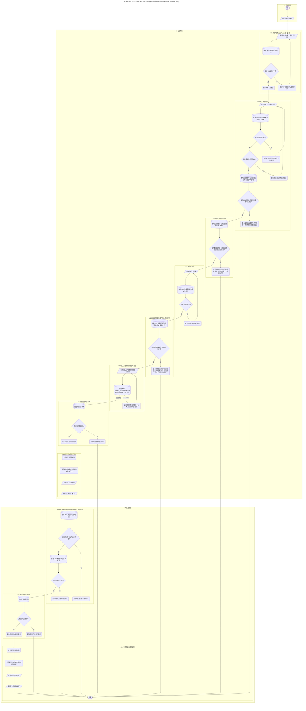

```mermaid
---
title: 操作员存入归还焊丝并取出可用焊丝(Operator Return Wire and Issue Available Wire)
---
flowchart TB
%% =========================
%% 1. 节点定义
%% =========================

%% 1.1 切换界面
subgraph switchUI[1.1 切换界面]
%% 1.1.1 普通节点
    start(["开始"])
    switchOPUI[/"切换到操作员界面"/]
end

%% 1.2 归还焊丝
subgraph returnWire[1.2 归还焊丝]
%% 1.2.1 输入操作员工号、班组、班次
subgraph inputOperatorInfo[1.2.1 输入操作员工号、班组、班次]
%% 1.2.1.1 普通节点
    inputOperatorWorkInfo[/"操作员输入工号、班组、班次"/]
    queryOPById[("查询 MES 数据库该操作人员")]
    showOPName("显示操作人员姓名")
%% 1.2.1.2 判断节点
    checkOPIdExists{"是否存在该操作人员?"}
%% 1.2.1.3 异常处理节点
    showOPIdNotExistsMessage("显示不存在该操作人员的提示")
end

%% 1.2.2 输入焊丝批号
subgraph inputReturnedWireLotNoSection[1.2.2 输入焊丝批号]
%% 1.2.2.1 普通节点
    inputReturnedWireLotNo[/"操作员输入归还焊丝批号"/]
    queryWireSpecByLotNo[("查询 MES 数据库该批号对应的焊丝规格")]
    queryMatchedAvailableWire[("查询应用数据库发货柜内匹配的同规格可用焊丝")]
%% 1.2.2.2 判断节点
    checkWireLotNoExists{"焊丝批号是否存在?"}
    checkWireSpecExists{"焊丝规格数据是否存在?"}
    checkMatchedWireExists{"发货柜内是否有匹配的同规格可用焊丝?"}
%% 1.2.2.3 异常处理节点
    showWireLotNoInputInvalidOrNotExistsMessage("显示焊丝批号不存在或不合法的提示")
    showWireSpecNotExistsMessage("显示焊丝规格不存在的提示")
    showNoMatchedWireMessage("显示发货柜内没有匹配的焊丝，请到物料间领取的提示")
end

%% 1.2.3 获取焊丝归还重量
subgraph queryReturnedWeightSection[1.2.3 获取焊丝归还重量]
%% 1.2.3.1 普通节点
    queryWireReturnedWeightBySpec[("查询应用数据库该焊丝类型对应的归还重量")]
%% 1.2.3.2 判断节点
    checkReturnedWeightExists{"应用数据库中是否存在该焊丝类型的归还重量?"}
%% 1.2.3.3 异常处理节点
    showReturnedWeightNotExists("显示找不到该焊丝类型的归还重量，请到物料间人工归还的提示")
end

%% 1.2.4 输入机台号
subgraph inputEqpNoSection[1.2.4 输入机台号]
%% 1.2.4.1 普通节点
    inputEqpNo[/"操作员输入机台号"/]
    queryEqpByEqpNo[("查询 MES 数据库该机台号对应机台")]
%% 1.2.4.2 判断节点
    checkEqpNoExists{"该机台是否存在?"}
%% 1.2.4.3 异常处理节点
    showEqpNoNotExistsMessage("显示不存在该机台号的提示")
end

%% 1.2.5 获取机台最近生产的产品批次号
subgraph queryLastProductLotNoSection[1.2.5 获取机台最近生产的产品批次号]
%% 1.2.5.1 普通节点
    queryLastProductLotNo[("查询 MES 数据库该机台最近生产的产品批次号")]
%% 1.2.5.2 判断节点
    checkLastProductLotNoExists{"是否查询到最近生产的产品批次号?"}
%% 1.2.5.3 异常处理节点
    showLastProductLotNoNotExistsMessage("显示找不到该机台对应的最近生产产品批次号，请到物料间人工归还的提示")
end

%% 1.2.6 输入产品剩余待焊芯片数量
subgraph inputRemainingQtySection[1.2.6 输入产品剩余待焊芯片数量]
%% 1.2.6.1 普通节点
    inputRemainingQty[/"操作员输入产品剩余待焊芯片数量"/]
    queryWireQuotaCheck[("调用 MES Get_Mat_QuotaCheck 查询实际与理论消耗差值（米）")]
%% 1.2.6.2 异常处理节点
    showRemainingQtyWrongHint("显示剩余待焊芯片数量不正确，重新输入的提示")
end

%% 1.2.7 提交归还焊丝请求
subgraph submitWireReturnSection[1.2.7 提交归还焊丝请求]
%% 1.2.7.1 普通节点
    submitWireReturn[("提交焊丝归还请求")]
    showWireReturnSuccessMessage("显示焊丝归还成功的提示")
%% 1.2.7.2 判断节点
    checkSubmitWireReturnSuccess{"焊丝归还是否成功?"}
%% 1.2.7.3 异常处理节点
    showWireReturnFailMessage("显示焊丝归还失败的提示")
end

%% 1.2.8 操作员存入归还焊丝
subgraph loadReturnedWireSection[1.2.8 操作员存入归还焊丝]
%% 1.2.8.1 普通节点
    openReturnSlot("发货柜打开归还格口")
    showLoadWireAndCloseDoorMessage("提示操作员放入对应焊丝并关闭格口门")
    loadReturnedWire[/"操作员存入归还焊丝"/]
    closeReturnSlotDoor[/"操作员关闭归还格口门"/]
end
end

%% 1.3 领用焊丝
subgraph issueWire[1.3 领用焊丝]
%% 1.3.1 查询该可用焊丝信息和查询产品批次信息
subgraph queryWireAndProductSection[1.3.1 查询该可用焊丝信息和查询产品批次信息]
%% 1.3.1.1 普通节点
    queryWireByLotNo[("查询 MES 数据库可用焊丝信息")]
    queryProductByLotNo[("查询 MES 数据库产品批次信息")]
%% 1.3.1.2 判断节点
    checkWireInfoExists{"可用焊丝是否存在对应信息?"}
    checkProductInfoExists{"产品信息是否存在?"}
%% 1.3.1.3 异常处理节点
    showWireInfoNotExists("显示焊丝信息不存在的提示")
    showProductInfoNotExists("显示产品信息不存在的提示")
end

%% 1.3.2 提交领用焊丝请求
subgraph submitWireIssueSection[1.3.2 提交领用焊丝请求]
%% 1.3.2.1 普通节点
    submitWireIssue[("提交焊丝领用请求")]
    showWireIssueSuccessMessage("显示焊丝领用成功的提示")
%% 1.3.2.2 判断节点
    checkSubmitWireIssueSuccess{"焊丝领用是否成功?"}
%% 1.3.2.3 异常处理节点
    showWireIssueFailMessage("显示焊丝领用失败的提示")
end

%% 1.3.3 操作员取出领用焊丝
subgraph unloadIssueWireSection[1.3.3 操作员取出领用焊丝]
%% 1.3.3.1 普通节点
    openIssueSlot("发货柜打开领用格口")
    unloadWire[/"操作员取出可用焊丝"/]
    showUnloadWireAndCloseDoorMessage("提示操作员取出对应焊丝并关闭格口门")
    closeIssueSlotDoor[/"操作员关闭领用格口门"/]
    End(["结束"])
end
end
      
%% =========================
%% 2. 流程连线
%% =========================

%% 2.1 切换界面
%% 2.1.1 主流程
    start ---> switchOPUI
    switchOPUI ---> inputOperatorWorkInfo

%% 2.2 归还焊丝
%% 2.2.1 输入操作员工号、班组、班次
%% 2.2.1.1 主流程
    inputOperatorWorkInfo ---> queryOPById
    queryOPById ---> checkOPIdExists
    checkOPIdExists -- 是 --> showOPName
%% 2.2.1.2 分支流程1
    checkOPIdExists -- 否 --> showOPIdNotExistsMessage
    showOPIdNotExistsMessage ---> inputOperatorWorkInfo

%% 2.2.2 输入焊丝批号
%% 2.2.2.1 主流程
    showOPName ---> inputReturnedWireLotNo
    inputReturnedWireLotNo ---> queryWireSpecByLotNo
    queryWireSpecByLotNo ---> checkWireLotNoExists
    checkWireLotNoExists -- 是 --> checkWireSpecExists
    checkWireSpecExists -- 是 --> queryMatchedAvailableWire
    queryMatchedAvailableWire ---> checkMatchedWireExists
    checkMatchedWireExists -- 是 --> queryWireReturnedWeightBySpec
%% 2.2.2.2 分支流程1
    checkWireLotNoExists -- 否 --> showWireLotNoInputInvalidOrNotExistsMessage
    showWireLotNoInputInvalidOrNotExistsMessage ---> inputReturnedWireLotNo
%% 2.2.2.3 分支流程2
    checkWireSpecExists -- 否 --> showWireSpecNotExistsMessage
    showWireSpecNotExistsMessage ---> inputReturnedWireLotNo
%% 2.2.2.4 分支流程3
    checkMatchedWireExists -- 否 --> showNoMatchedWireMessage
    showNoMatchedWireMessage ---> End

%% 2.2.3 获取焊丝归还重量
%% 2.2.3.1 主流程
    queryWireReturnedWeightBySpec ---> checkReturnedWeightExists
    checkReturnedWeightExists -- 是 --> inputEqpNo
%% 2.2.3.2 分支流程1
    checkReturnedWeightExists -- 否 --> showReturnedWeightNotExists
    showReturnedWeightNotExists ---> End

%% 2.2.4 输入机台号
%% 2.2.4.1 主流程
    inputEqpNo ---> queryEqpByEqpNo
    queryEqpByEqpNo --> checkEqpNoExists
    checkEqpNoExists -- 是 --> queryLastProductLotNo
%% 2.2.4.2 分支流程1 
    checkEqpNoExists -- 否 --> showEqpNoNotExistsMessage
    showEqpNoNotExistsMessage ---> inputEqpNo

%% 2.2.5 获取机台最近生产的产品批次号
%% 2.2.5.1 主流程
    queryLastProductLotNo ---> checkLastProductLotNoExists
    checkLastProductLotNoExists -- 是 --> inputRemainingQty
%% 2.2.5.2 分支流程1
    checkLastProductLotNoExists -- 否 --> showLastProductLotNoNotExistsMessage
    showLastProductLotNoNotExistsMessage ---> End

%% 2.2.6 输入产品剩余待焊芯片数量
%% 2.2.6.1 主流程
    inputRemainingQty ---> queryWireQuotaCheck
    queryWireQuotaCheck -- 返回数值 --> submitWireReturn
%% 2.2.6.2 分支流程1
    queryWireQuotaCheck -- ORA-20007 --> showRemainingQtyWrongHint
    showRemainingQtyWrongHint ---> inputRemainingQty
    
%% 2.2.7 提交归还焊丝请求
%% 2.2.7.1 主流程
    submitWireReturn ---> checkSubmitWireReturnSuccess
    checkSubmitWireReturnSuccess -- 是 --> showWireReturnSuccessMessage
    showWireReturnSuccessMessage ---> openReturnSlot
%% 2.2.7.2 分支流程1
    checkSubmitWireReturnSuccess -- 否 --> showWireReturnFailMessage
    showWireReturnFailMessage ---> End

%% 2.2.8 操作员存入归还焊丝
%% 2.2.8.1 主流程
    openReturnSlot ---> showLoadWireAndCloseDoorMessage
    showLoadWireAndCloseDoorMessage ---> loadReturnedWire 
    loadReturnedWire ---> closeReturnSlotDoor
    closeReturnSlotDoor ---> queryWireByLotNo


%% 2.3 领用焊丝
%% 2.3.1 查询该可用焊丝信息和查询产品批次信息
%% 2.3.1.1 主流程
    queryWireByLotNo ---> checkWireInfoExists
    checkWireInfoExists -- 是 --> queryProductByLotNo
    queryProductByLotNo ---> checkProductInfoExists
    checkProductInfoExists -- 是 --> submitWireIssue
%% 2.3.1.2 分支流程1
    checkWireInfoExists -- 否 --> showWireInfoNotExists
    showWireInfoNotExists ---> End
%% 2.3.1.3 分支流程2
    checkProductInfoExists -- 否 --> showProductInfoNotExists
    showProductInfoNotExists ---> End

%% 2.3.2 提交领用焊丝请求
%% 2.3.2.1 主流程
    submitWireIssue ---> checkSubmitWireIssueSuccess
    checkSubmitWireIssueSuccess -- 是 --> showWireIssueSuccessMessage
    showWireIssueSuccessMessage ---> openIssueSlot
%% 2.3.2.2 分支流程1
    checkSubmitWireIssueSuccess -- 否 --> showWireIssueFailMessage
    showWireIssueFailMessage ---> End

%% 2.3.3 操作员取出领用焊丝
%% 2.3.3.1 主流程
    openIssueSlot ---> showUnloadWireAndCloseDoorMessage
    showUnloadWireAndCloseDoorMessage ---> unloadWire
    unloadWire ---> closeIssueSlotDoor
    closeIssueSlotDoor ---> End   
```
