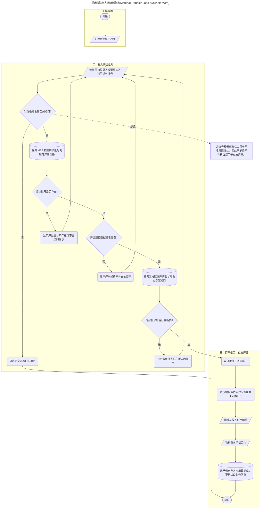

```mermaid
---
title: 物料员存入可用焊丝(Material Handler Load Available Wire)
---
flowchart TB
%% =========================
%% 1. 节点定义
%% =========================

%% 1.1 切换界面
subgraph switchUI[一、切换界面]
%% 1.1.1 普通节点
    start(["开始"])
    switchMHUI[/"切换到物料员界面"/]
end

%% 1.2 输入焊丝批号
subgraph inputWireLotNo[二、输入焊丝批号]
%% 1.2.1 普通节点
    inputAvailableWireLotNo[/"物料员扫码录入或键盘输入可用焊丝批号"/]
    queryWireSpecByLotNo[("查询 MES 数据库该批号对应的焊丝规格")]
%% 1.2.2 判断节点
    checkAvailableSlot{"发货柜是否有空闲格口?"}
    checkWireLotNoExists{"焊丝批号是否存在?"}
    checkWireSpecExists{"焊丝规格数据是否存在?"}
    queryAppWireLotNo[("查询应用数据库该批号是否已绑定格口")]
    checkAppWireLotNoAlreadyExists{"焊丝批号是否已在柜内?"}
%% 1.2.3 异常处理节点
    showNoAvailableSlotMessage("显示无空闲格口的提示")
    showWireLotNoInputInvalidOrNotExistsMessage("显示焊丝批号不存在或不合法的提示")
    showWireSpecNotExistsMessage("显示焊丝规格不存在的提示")
    showWireLotNoAlreadyInCabinetMessage("显示焊丝批号已在柜内的提示")
end

%% 1.3 打开格口，存放焊丝
subgraph openSlotLoadWire[三、打开格口，存放焊丝]
%% 1.3.1 普通节点
    openAvailableSlot("发货柜打开空闲格口")
    showLoadWireAndCloseDoorMessage("提示物料员放入对应焊丝并关闭格口门")
    loadAvailableWire[/"物料员放入可用焊丝"/]
    closeAvailableSlotDoor[/"物料员关闭格口门"/]
    updateDB[("焊丝信息存入应用数据库，更新格口业务信息")]
    End(["结束"])
end

    
%% =========================
%% 2. 流程连线
%% =========================

%% 2.1 切换界面
%% 2.1.1 主流程
    start ---> switchMHUI
    switchMHUI ---> inputAvailableWireLotNo

%% 2.2 输入焊丝批号
%% 2.2.1 主流程
    inputAvailableWireLotNo ---> checkAvailableSlot
    checkAvailableSlot -- 是 --> queryWireSpecByLotNo
    queryWireSpecByLotNo ---> checkWireLotNoExists
    checkWireLotNoExists -- 是 --> checkWireSpecExists
    checkWireSpecExists -- 是 --> queryAppWireLotNo
    queryAppWireLotNo ---> checkAppWireLotNoAlreadyExists
    checkAppWireLotNoAlreadyExists -- 否 --> openAvailableSlot
%% 2.2.2 异常流程1
    checkAvailableSlot -- 否 --> showNoAvailableSlotMessage
    showNoAvailableSlotMessage ---> End
%% 2.2.3 异常流程2
    checkWireLotNoExists -- 否 --> showWireLotNoInputInvalidOrNotExistsMessage
    showWireLotNoInputInvalidOrNotExistsMessage ---> inputAvailableWireLotNo
%% 2.2.4 异常流程3
    checkWireSpecExists -- 否 --> showWireSpecNotExistsMessage
    showWireSpecNotExistsMessage ---> inputAvailableWireLotNo
%% 2.2.5 异常流程4
    checkAppWireLotNoAlreadyExists -- 是 --> showWireLotNoAlreadyInCabinetMessage
    showWireLotNoAlreadyInCabinetMessage ---> inputAvailableWireLotNo
    
%% 2.3 打开格口，存放焊丝
%% 2.3.1 主流程  
    openAvailableSlot ---> showLoadWireAndCloseDoorMessage
    showLoadWireAndCloseDoorMessage ---> loadAvailableWire
    loadAvailableWire ---> closeAvailableSlotDoor
    closeAvailableSlotDoor ---> updateDB
    updateDB ---> End
    
%% =========================
%% 3. 注释连线
%% =========================
    checkAvailableSlot -.说明.-> explainCheckAvailableSlotNode["系统会预留部分格口用于回收归还焊丝，因此不能将所有格口都用于存放焊丝。"]
```