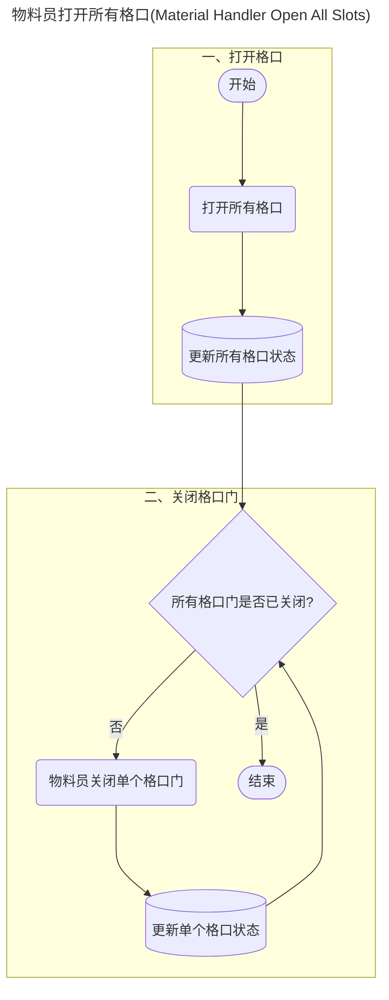

```mermaid
---
title: 物料员打开所有格口(Material Handler Open All Slots)
---
flowchart TB

%% =========================
%% 1. 节点定义
%% =========================

%% 1.1 打开格口
subgraph openSlots[一、打开格口]
    start(["开始"])
    openAllSlots("打开所有格口")
    updateAllSlots[("更新所有格口状态")]
end

%% 1.2 关闭格口门
subgraph closeSlotDoors[二、关闭格口门]
    isAllSlotDoorsClosed{"所有格口门是否已关闭?"}
    closeSingleSlotDoor("物料员关闭单个格口门")
    updateSlot[("更新单个格口状态")]
    End(["结束"])
end

%% =========================
%% 2. 流程连线
%% =========================

%% 2.1 打开格口
    start ---> openAllSlots
    openAllSlots ---> updateAllSlots
    updateAllSlots ---> isAllSlotDoorsClosed

%% 2.2 关闭格口门
    isAllSlotDoorsClosed -- 是 --> End
    isAllSlotDoorsClosed -- 否 --> closeSingleSlotDoor
    closeSingleSlotDoor ---> updateSlot
    updateSlot ---> isAllSlotDoorsClosed
```
