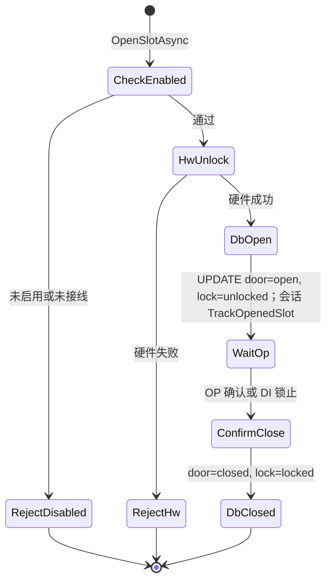

# 0.1 格口控制层 — 详细设计

## 1. 文档说明

| 项 | 内容 |
|----|------|
| 概要设计 | [格口控制层-概要设计.md](格口控制层-概要设计.md) |
| 硬件详细设计 | [格口硬件控制层-详细设计.md](格口硬件控制层-详细设计.md) |
| 参考 mock | [WireFlowLab/SlotControl/ISlotController.cs](../../../validation/wire-flow-lab/src/WireFlowLab/SlotControl/ISlotController.cs) |

## 2. 数据模型（app_slot 0.1）

在 [wire-flow-lab schema](../../../validation/wire-flow-lab/data-access-sql/schema/tables/app_slot.yaml) 基础上，0.1 建议：

| 列 | 类型 | 说明 |
|----|------|------|
| `slot_id` | INTEGER PK | 内部主键 |
| `slot_no` | TEXT | **SlotCode**（格口业务编号），如 `F-A01`；含义见 [格口硬件控制层-概要设计 §3.1](格口硬件控制层-概要设计.md) |
| `door_position` | TEXT | 可选，`front(1,1)` |
| `slot_index` | INTEGER | 可选，批量开锁排序（与 slot-config 一致） |
| `is_enabled` | INTEGER | 1/0，未接线必须为 0 |
| `io_wired` | INTEGER | 1/0，与 slot-config 同步 |
| `usage_type` | TEXT | `available` / `returned` / `shared` |
| `biz_state` | TEXT | 仅库存：`idle` / `available_wire` / `returned_wire`；**开锁不改** |
| `door_state` | TEXT | `open` / `closed` |
| `lock_state` | TEXT | `locked` / `unlocked` |
| 焊丝字段 | … | `wire_lot_no` 等，流程写库 |

**种子数据**：演示可用 8 格（wire-flow-lab seed）；验收前用脚本从 [slots.generated.yaml](../wire-cabinet/slot-config/slots.generated.yaml) 导入 54 格。

## 3. 接口定义（C#）

### 3.1 请求/结果

```csharp
public sealed class OpenSlotRequest
{
    public long? SlotId { get; init; }
    public string? SlotNo { get; init; }      // SlotCode，与 slot_no 二选一
    public string? OperatorId { get; init; }
    public string Source { get; init; } = ""; // flow_id 或 "maintenance"
    public string? SessionId { get; init; }
}

public sealed class OpenSlotResult
{
    public bool Success { get; init; }
    public string SlotNo { get; init; } = "";
    public long SlotId { get; init; }
    public string Message { get; init; } = "";
}

public sealed class BatchOpenOptions
{
    public int IntervalMs { get; init; } = 500;
    public bool StopOnFailure { get; init; } = true;
}

public sealed class BatchOpenResult
{
    public IReadOnlyList<OpenSlotResult> Results { get; init; } = Array.Empty<OpenSlotResult>();
    public bool CompletedAll { get; init; }
}
```

### 3.2 ISlotControlService

```csharp
public interface ISlotControlService
{
    Task<OpenSlotResult> OpenSlotAsync(OpenSlotRequest request, CancellationToken ct = default);
    Task<BatchOpenResult> OpenSlotsBatchAsync(
        IReadOnlyList<string> slotCodes,
        BatchOpenOptions options,
        OpenSlotRequest template,
        CancellationToken ct = default);

    Task<bool> ConfirmDoorClosedAsync(long slotId, CancellationToken ct = default);
    Task<bool> ConfirmManualPutOrTakeAsync(long slotId, string action, CancellationToken ct = default);

    Task<SlotStatusDto?> GetSlotStatusAsync(long slotId, CancellationToken ct = default);
    Task<SlotStatusDto?> GetSlotStatusByNoAsync(string slotNo, CancellationToken ct = default);
    Task<IReadOnlyList<SlotStatusDto>> ListSlotsAsync(SlotListFilter filter, CancellationToken ct = default);

    bool AreAllDoorsClosed();
    bool HasUnlockInProgress();
    IReadOnlyList<long> OpenSlotIds();

    /// <summary>供 RCS AgvControlLoop：聚合 DI + DB，不经过 closeFlag。</summary>
    Task<DoorStateInput> GetDoorStateForAgvAsync(CancellationToken ct = default);
}
```

### 3.3 操作会话（0.1 不用 `biz_state=processing`）

```csharp
public interface IWireOperationSession
{
    bool HasActiveSession { get; }
    string? ActiveFlowId { get; }
    IReadOnlyList<long> OpenSlotIds { get; }

    /// <summary>进入焊丝流程界面时调用；已有会话则返回 false。</summary>
    bool TryBegin(string flowId);

    void TrackOpenedSlot(long slotId);
    void End();
}
```

`SlotControlService.OpenSlotAsync` 前置条件：

1. `TryBegin` 已由当前流程调用（或同一会话内继续开下一格）。
2. `is_enabled`、`io_wired`、硬件可用。
3. 硬件成功后：`UPDATE door_state, lock_state` only + `TrackOpenedSlot(slotId)`。

UI：进入第二个 flow 前检查 `HasActiveSession`，有则提示「请先完成或退出当前操作」。

### 3.4 SlotStatusDto

```csharp
public sealed class SlotStatusDto
{
    public long SlotId { get; init; }
    public string SlotNo { get; init; } = "";
    public string BizState { get; init; } = "";
    public string DoorState { get; init; } = "";
    public string LockState { get; init; } = "";
    public bool IsEnabled { get; init; }
    public bool IoWired { get; init; }
    public HardwareLockState? HardwareLock { get; init; }
}
```

## 4. 门联锁聚合与 IDoorStateProvider

### 4.1 聚合规则（0.1 推荐）

对集合 **S** = 所有 `is_enabled=1` 且 `io_wired=1` 的格口：

| 判定 | 条件 |
|------|------|
| 单格「未关」 | 硬件 DI **=0**（`Unlocked`，释锁即门自动开），**或** `app_slot.door_state='open'`，**或** DI `ReadFailed` |
| `AnyDoorOpen` | S 中任一格「未关」 |
| `AllDoorsClosed` | S 非空且全部 DI **=1**（`Locked`），且 DB 无残留 `open` |

本柜无门磁：**DI=0** 即该格门已弹开；`door_state=open` 与 DI=0 通常同时出现。关门后应 **DI 先变 1**，再更新 DB 为 `closed`。

```csharp
public async Task<DoorStateInput> GetDoorStateForAgvAsync(CancellationToken ct = default)
{
    var codes = await _repo.GetInterlockSlotCodesAsync(ct);
    var hw = await _hardware.ReadInterlockLockStatesAsync(ct);
    var db = await _repo.GetDoorStatesAsync(codes, ct);

    var openSlots = new List<string>();
    foreach (var code in codes)
    {
        var unlocked = hw.TryGetValue(code, out var ls) &&
                       (ls == HardwareLockState.Unlocked || ls == HardwareLockState.ReadFailed);
        var dbOpen = db.TryGetValue(code, out var ds) && ds == "open";
        if (unlocked || dbOpen) openSlots.Add(code);
    }

    return new DoorStateInput
    {
        AllDoorsClosed = codes.Count > 0 && openSlots.Count == 0,
        AnyDoorOpen = openSlots.Count > 0,
        CloseFlag = null
    };
}
```

### 4.2 CabinetDoorStateProvider

```csharp
public sealed class CabinetDoorStateProvider : IDoorStateProvider
{
    private readonly ISlotControlService _slots;
    public Task<DoorStateInput> GetDoorStateAsync(CancellationToken ct = default)
        => _slots.GetDoorStateForAgvAsync(ct);
}
```

注册到 DI，供 [AgvControlLoop](../wire-cabinet/agv-dispatch-sdk/AgvDispatch.Sample/Integration/AgvControlLoop.cs) 使用。

### 4.3 移动中持续门状态监测（0.1 必须）

| 阶段 | 行为 |
|------|------|
| 下发移动单前 | `GetDoorStateForAgvAsync()` → 须 `AllDoorsClosed`，否则拒绝下单 |
| 车辆 **非空闲 / 执行中**（`sys_state` 非 IDLE 或 UI `Moving`） | 控车循环 **每个 Tick** 再次调用 `GetDoorStateForAgvAsync()`（**实时读 DI**，DB 作辅助） |
| 监测到 `AnyDoorOpen` | `AgvOperationEvaluator` → `ShouldPauseForDoor` → `PauseMovementAsync` |
| 门恢复全关且此前因门暂停 | `ContinueMovementAsync` |

目的：移动过程中若某格 **突然释锁**（锁机构损坏、线圈 stuck 等），DI 会变为 `Unlocked`，须在下一 Tick 暂停 AGV，不能只在发车前检查一次。

实现参考：`AgvControlLoop.TickAsync` 每轮拉车辆状态 + `IDoorStateProvider.GetDoorStateAsync()` + `Evaluate`。

### 4.4 与 SDK 遗留 API

- `DoorStateInput.FromCloseFlag` / `ExpectedDoorCount`：**仅** agv-dispatch-sdk Sample 与单元测试模拟旧上位机。
- 0.1 业务 **不要** 配置 `SimulatedCloseFlag`；生产注入 `CabinetDoorStateProvider`。

## 5. 单格开锁状态机



### 5.1 与 SQL 的对应

| 步骤 | sql_id | 说明 |
|------|--------|------|
| 开门前查状态 | `app.slot.get_status` | 读 `slot_id`、`door_state`、`biz_state`（库存） |
| 硬件开锁 | — | `ISlotHardwareService.UnlockAsync(slot_no)` |
| 落库开门 | `app.slot.open` | **仅** `door_state=open`, `lock_state=unlocked` |
| 关门（仅门/锁） | `app.slot.update_state` | `door_state=closed`, `lock_state=locked`；`biz_state` 传空则不改 |
| MH 维护关门（库存） | **`app.slot.assume_empty`**（0.1 新增） | 对本流程已打开且已关门的格：`biz_state=idle`，`wire_*` 置 NULL；见概要 §3.2.1 |
| MH 存丝完成 | `app.slot.bind_wire` | `biz_state=available_wire` + 批号/规格 |
| OP 存废取新 | 流程各节点 SQL | 归还/领取按 MES 与节点约定写 `returned_wire` / `idle` 等 |
| 全门关闭判断 | `app.slot.are_all_doors_closed` | 查 DB + 可选 DI 校验 |

**`app.slot.assume_empty`（建议 SQL，0.1 待入 catalog）**：

```sql
UPDATE app_slot
SET biz_state = 'idle',
    wire_lot_no = NULL, wire_spec = NULL, wire_code = NULL,
    shelflife = NULL, matlot = NULL, qty = NULL, wire_state = NULL,
    door_state = COALESCE(NULLIF(:door_state, ''), door_state),
    lock_state = COALESCE(NULLIF(:lock_state, ''), lock_state),
    updated_at = datetime('now')
WHERE slot_id = :slot_id;
```

MH 维护流程的 `updateSlot` 节点在 `door_state=closed` 时调用；`updateCorrespondingSlots` 开门阶段仍 **只改门/锁**，库存变更在 **逐格关门** 时执行。

生产 0.1：**禁止**仅用 mock 更新门状态；`app.slot.open` 在硬件 `Success` 之后执行。

## 6. 批量开锁

```text
slotCodes = 流程筛选结果（可用/归还/全部），按 slot_index 升序
foreach code in slotCodes:
  if !slot.is_enabled: skip
  result = OpenSlotAsync(...)
  if !result.Success && options.StopOnFailure: break
  await Delay(options.IntervalMs)
return BatchOpenResult
```

配置建议（`appsettings` 或 UI 配置）：

| 参数 | 0.1 冻结值 | 说明 |
|------|------------|------|
| `SlotBatchOpen:IntervalMs` | **400**（允许现场在 **300～500** 内调整） | 相邻两格开锁间隔 |
| `SlotBatchOpen:StopOnFailure` | **true** | 任一格失败 **立刻中止** 整批，不继续开后序格口 |

维护流程 **不要求到站**（[需求范围.md](../需求范围.md) §3.3）；焊丝存取流程仍受到站门禁约束。

## 7. 联锁矩阵（应用层）

格口控制层 **提供信号**；下表为应用/UI/控车循环的 **组合策略**（0.1 必须实现）：

| 条件 | 禁止手动控车 | 禁止焊丝开锁 | 移动中持续监测 → Pause |
|------|:------------:|:------------:|:------------------------:|
| `HasUnlockInProgress()` | 是 | 是 | — |
| 存取会话活跃（应用标志） | 是 | 是 | — |
| 出发前 `!AllDoorsClosed` | 是 | — | — |
| 移动中 `AnyDoorOpen`（每 Tick 重读 DI+DB） | — | — | 是 |
| `IWireOperationSession.HasActiveSession` | 是 | 是 | — |
| 充电中（RCS `CHARGING`） | **否** | 是 | 门开仍 Pause（与充电态无关） |
| 未到站 / 不在作业站 | — | 是（MH/OP 焊丝界面） | — |

`AgvOperationEvaluator` 已消费 `DoorStateInput`（非 IDLE + 门开 → Pause）；移动前还需 `HasUnlockInProgress` + 操作会话 + 门全关（应用层组合）。**充电中不阻断控车**，仅阻断格口开锁。

## 8. 流程节点调用链

| 节点示例 | 调用 |
|----------|------|
| `openSingleSlot` | `GetSlotStatus` → `OpenSlotAsync(selected)` |
| `openAvailableSlot` | `find_available` → `OpenSlotAsync` |
| `openAllAvailableWireSlots` | `list_by_filter` → `OpenSlotsBatchAsync` |
| `isAllSlotDoorsClosed` | `AreAllDoorsClosed()` 或 SQL `app.slot.are_all_doors_closed` |
| `closeSingleSlotDoor` | `ConfirmDoorClosedAsync` / 读 DI 辅助 |

## 9. 中文错误码（控制层）

| 场景 | Message |
|------|---------|
| 格口不存在 | 格口 {slotNo} 不存在 |
| 已禁用 | 格口 {slotNo} 已禁用，无法开锁 |
| 硬件失败 | 透传硬件层 `HardwareUnlockResult.Message` |
| 并发会话 | 当前有格口操作进行中，请完成后再试 |
| 未到站 | 请先移动至 {station} 站后再操作（应用层） |
| 充电中 | 充电中无法开格口（应用层） |
| 关门未完成 | 请先关闭所有格口后再移动 |

## 10. 与 wire-flow-lab 的差异

| 项 | wire-flow-lab | 0.1 交付 |
|----|---------------|----------|
| `ISlotController` | Mock，直接改 DB | `ISlotControlService` + 真实硬件 |
| `biz_state=processing` | lab 枚举有 | **不用**；改会话 + `door_state` |
| `app.slot.open` | 仅门/锁 | 同左；硬件成功后 UPDATE |
| 格口数量 | 8 格 seed | 54 格配置导入 |

## 11. 类结构（建议）

```text
SlotControlService : ISlotControlService
  ├── ISlotHardwareService
  ├── IAppSlotRepository
  ├── IWireOperationSession       # 流程互斥 + 本流程已开格口列表
  ├── IUnlockInProgressTracker    # 硬件开锁中标志
  └── IOperationLogWriter

CabinetDoorStateProvider : IDoorStateProvider
  └── ISlotControlService.GetDoorStateForAgvAsync
```

## 12. 配置导入（54 格）

1. 运行 [export_slot_config.py](../wire-cabinet/slot-config/_tools/export_slot_config.py)。
2. 导入脚本：遍历 `slots.generated.yaml` + `slot-io-mapping.generated.yaml` INSERT `app_slot`。
3. `is_enabled = wired && enabled_default`。
4. 冻结 **联锁格口数**（enabled∧wired，全柜接线时为 54）写入验收配置表（[验收清单.md](../验收清单.md) §7）。

## 13. 验收对照

- 脚本 1/2：真实开锁 + 门/锁状态 + 流程结束后库存 `biz_state` 正确 + 日志。
- 脚本 5：单开 + 至少一种 bulk 流程。
- §3 B 级：≥2 格真开锁，映射表覆盖全柜。

## 14. 相关文档

- [格口硬件控制层-详细设计.md](格口硬件控制层-详细设计.md)
- [需求范围.md](../需求范围.md) §6
- [RCS协同层-0.1.md](RCS协同层-0.1.md)
