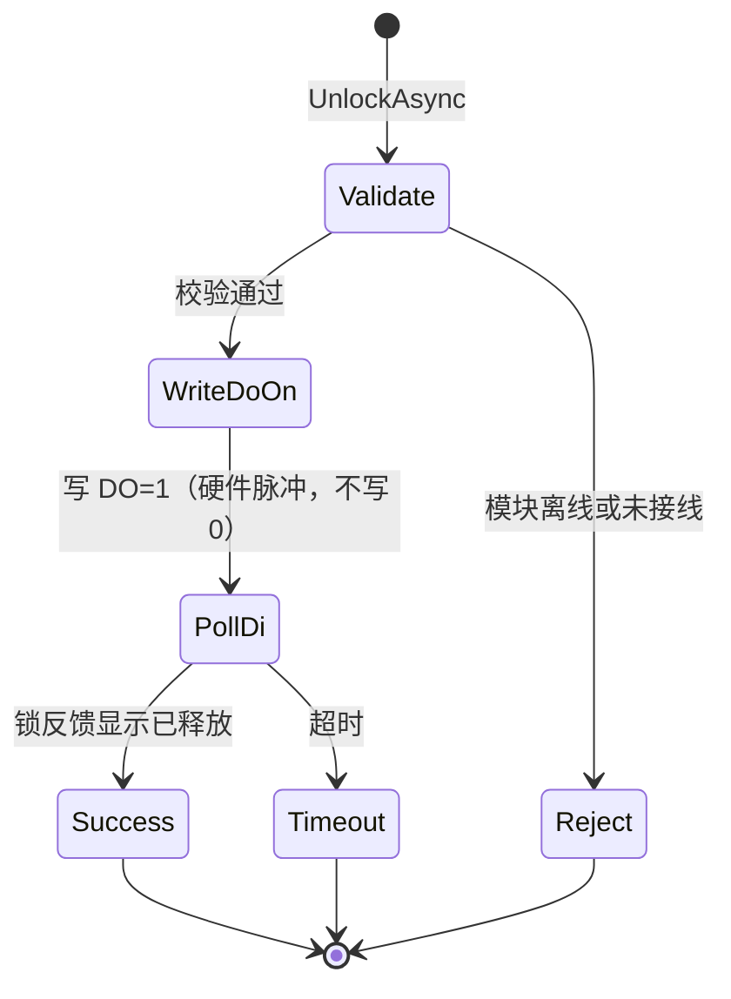

# 0.1 格口硬件控制层 — 概要设计

## 1. 文档说明

| 项 | 内容 |
|----|------|
| 版本 | 0.1 |
| 母版 | [baseline/格口硬件控制层.md](../../../baseline/格口硬件控制层.md) |
| 范围 | [需求范围.md](../需求范围.md) §6、[验收清单.md](../验收清单.md) §3 |
| 配置 | [../wire-cabinet/slot-config/](../wire-cabinet/slot-config/)（由现场 xlsx 导出） |
| 详细设计 | [格口硬件控制层-详细设计.md](格口硬件控制层-详细设计.md) |

本文档描述 0.1 裁剪后的硬件层边界、能力与架构，不重复 baseline 全文。

## 2. 定位与职责

格口硬件控制层负责 **与 IO 模块通信**，向格口控制层返回真实、可用的硬件结果。

```text
格口控制层（业务抽象、app_slot）
        ↕ ISlotHardwareService
格口硬件控制层（Modbus TCP、DO/DI）
        ↕
IO 模块 × 4 → 电子锁（DO 开锁，DI 读锁反馈）
```

**负责**：模块连接；按 **SlotCode**（见 §3.1）**单格**开锁；读取电子锁**锁状态反馈**（经 IO 模块 **DI** 输入点，见 §2.1）；对参与联锁的格口**批量读**上述反馈；通信与开锁异常识别、硬件日志。

**不负责**：**批量开锁编排**（间隔、失败是否中止、按业务筛选格口列表）——由 [格口控制层](格口控制层-概要设计.md) 循环调用本层 `UnlockAsync`；OP 权限、MES/库存、格口业务状态、是否允许移动。

### 2.1 术语：锁反馈 vs 锁状态 DI

本柜**没有独立门磁**，且**锁释放后柜门会自动弹开**（机构联动，非 OP 再去拉门）。每一格与 IO 表的对应关系为：**同位置 `DOn`（开锁输出）+ `DIn`（读回）**。

| 说法 | 指什么 |
|------|--------|
| **锁状态反馈** / **锁反馈** | 电子锁机构输出的电气信号（锁舌是否锁住、是否释放） |
| **锁状态 DI** / **读 DI** | IO 模块上接入该反馈的**离散输入点**（配置里的 `DI12` 等）；软件通过 Modbus 读该点 |
| **DI 电平（本柜）** | **DI=1 → 锁闭合**；**DI=0 → 锁释放**（见详细设计 §5.1） |
| **锁状态**（逻辑） | `Locked` / `Unlocked`（由 DI 电平映射，见 `HardwareLockState`） |
| **门开/门关**（本柜） | **无单独门磁**。DI=0（释锁）→ 门**自动弹开**；DI=1（锁闭合）→ 门已关且锁止 |

三者（锁机构→DI→逻辑）是**同一链路**。本柜上 **释锁 ≈ 门已开**，读 DI 即可同时用于「锁状态」与「是否允许 AGV 移动」判断，无需第二路门磁。

**开锁**走 **DO**（模块侧已配置为脉冲输出）；**读锁**走 **DI**（输入）。与 baseline「锁状态反馈」表述一致，0.1 不单独读门磁 DI。

## 3. 数据基线（现场柜）

| 项 | 值 |
|----|-----|
| 格口总数 | 54 |
| 库表主键 | `slot_id`（INTEGER 自增，`app_slot` 内部关联、外键） |
| 格口业务名 / 自然键 | **SlotCode**（如 `F-A01`，**唯一**，见 §3.1、§3.2） |
| 物理坐标 | `front(row,col)` / `rear(row,col)` |
| IO 模块标识 | `C4`、`24`、`67`、`BE`（sheet 名 = MAC 末两位） |
| 模块 IP | 现场提供，写入 `io-modules.yaml` 的 `host`（见 §3.3） |
| 每格接线 | 同位置 `DOn`（开锁 DO）+ `DIn`（锁状态反馈接入点） |
| BE 未接线 | `DO7`–`DO16` 无仓门位置（导出配置中无对应格口） |
| 有效 IO 对 | 54 |

编号与 IO 点位以 [../wire-cabinet/slot-config/](../wire-cabinet/slot-config/) 下 `*.generated.yaml` 为准；**IP 不在 xlsx 中**，由现场单独配置。

### 3.1 SlotCode（格口业务编号）是什么？

**SlotCode** 是**每一格仓口的稳定英文业务名（自然键）**，用来在软件里指代「开哪一格、读哪一路锁状态」；界面可显示中文名（`前-A01`）。来源为现场 [仓位信息/仓位编号.xlsx](../../../../仓位信息/仓位编号.xlsx) 的「英文编号」列，导出后 YAML 字段名为 `slot_code`。**数据库主键用 `slot_id`，不用 SlotCode 做主键**（见 §3.2）。

| 示例 SlotCode | 编码规则 | 中文显示名（HMI） | 物理坐标（对 IO 表） |
|---------------|----------|-------------------|----------------------|
| `F-A01` | `F` = 前面（Front），`A` = 行，`01` = 列 | `前-A01` | `front(1,1)` |
| `R-B02` | `R` = 后面（Rear） | `后-B02` | `rear(2,2)` |

**与其它标识的区别**（勿混用）：

| 标识 | 用途 |
|------|------|
| **`slot_id`** | 应用库 **主键**（自增）；库存、日志外键、流程节点 `selected_slot_id` |
| **SlotCode** | **唯一业务名**；HMI、日志、`UnlockAsync("F-A01")`、配置 `slot_code`、对外 API |
| `door_position` | `front(行,列)` / `rear(行,列)`，与 IO 表、现场接线对照 |
| `slot_index` | 1～54，批量开锁顺序、界面排序 |
| `module_key` + `DOn`/`DIn` | 硬件层查表后的 Modbus 点位，上层不应直接传 |

**查表开锁**：上层只传 SlotCode，硬件层在 `slot-io-mapping.generated.yaml` 中查到模块与 DO/DI，再发 Modbus。详见 [仓位信息/README.md](../../../../仓位信息/README.md)、[格口硬件控制层-详细设计.md](格口硬件控制层-详细设计.md) §2.2。

```text
UnlockAsync("F-A01")
    → 配置：door_position front(1,1) → 模块 C4 → DO12 / DI12
    → Modbus：连 io-modules.yaml 中 key=C4 的 host:port
```

### 3.2 主键用 `slot_id` 还是 SlotCode？

**推荐：两层标识，分工明确。**

| 层级 | 用谁 | 原因 |
|------|------|------|
| **应用库 `app_slot`** | `slot_id` 作主键 | 整数 JOIN/外键简单；焊丝库存、操作日志、流程节点已按 `slot_id` 设计（wire-flow-lab） |
| **唯一业务名** | `SlotCode`（`slot_no` 列存同值，**UNIQUE**） | 与人、现场、xlsx、配置一致；换柜贴牌仍认得「F-A01」 |
| **硬件 API** | 参数用 **SlotCode** | 运维/调试直观；内部查表得 `module_key` + DO/DI，再连模块 IP |
| **流程/UI** | 展示 SlotCode 或中文名；提交可带 `slot_id` 或 `slot_no` | 节点 YAML 已有 `slot_id`；实现时 `slot_no` = SlotCode 互查即可 |

**不建议**只用自增 id、把 SlotCode 当普通「显示名」：现场、IO 表、验收脚本都认 `F-A01`，没有稳定业务名会增加沟通和对照成本。

**不建议**用 SlotCode 当数据库主键：字符串主键、外键体积大；若将来编号规则调整，改主键会牵动全库历史数据（`slot_id` 不变则历史日志仍有效）。

导入 54 格时：`slot_id` 可与 `slot_index` 一致赋 1..54，或自增；**必须**保证 `slot_no` = SlotCode 且唯一。

### 3.3 IO 模块 IP（现场提供）

xlsx 只定义 **模块 key（C4/24/67/BE）与 DO/DI 点位**，**不包含 IP**。验收前由现场提供每块模块的 Modbus TCP 地址，写入：

1. 复制 [../wire-cabinet/slot-config/io-modules.template.yaml](../wire-cabinet/slot-config/io-modules.template.yaml) → `io-modules.yaml`（勿提交含真实内网 IP 到公共仓库时可 gitignore）。
2. 为每个 `modules[].key` 填写 `host`（及必要时 `port`、`unit_id`）。

```yaml
modules:
  - key: "C4"
    host: "<现场提供的 IP>"   # 例如 192.168.1.101
    port: 502
    enabled: true
```

硬件层启动时用 `module_key`（来自 slot-io-mapping）关联到对应 `host` 再建 Modbus 连接。IP 变更只改 `io-modules.yaml`，无需重导 xlsx。

## 4. 硬件拓扑

```text
触控屏 PC（.NET 宿主，如 AuxiLink）
    │ Modbus TCP（每模块独立 IP，见 io-modules.yaml）
    ├── 模块 C4  @ host₁  (16 路 DO/DI ↔ 16 格)
    ├── 模块 24  @ host₂
    ├── 模块 67  @ host₃
    └── 模块 BE  @ host₄  (6 路有效，DO7–16 未接)
```

- 一期通信：**Modbus TCP**。
- **寻址（本柜已确认）**：0-based；每模块 **DO×16** 起始线圈 **100**，**DI×16** 起始离散输入 **10200**；`DO12`→线圈 **111**，`DI12`→**10211**（见 [详细设计 §4.1](格口硬件控制层-详细设计.md)）。
- 不直接驱动锁线圈；由 **IO 模块** 对 DO 做脉冲输出，程序只写 **DO=1** 触发开锁（**不写 DO=0**），脉冲宽度与复位在模块上已配好。
- **无独立门磁**；**释锁后门自动打开**；DI：**1=锁闭合，0=锁释放**（见详细设计 §5.1）。

## 5. 0.1 能力矩阵（相对 baseline）

| baseline 能力 | 0.1 |
|---------------|-----|
| 多 IO 模块 Modbus TCP | 是 |
| 按 SlotCode 单开锁 | 是 |
| 批量开锁（多格顺序、间隔） | **否**（格口控制层编排） |
| 批量读锁反馈（联锁格口） | 是（`ReadInterlockLockStatesAsync`，仅 enabled ∧ wired） |
| 硬件脉冲开锁（写 DO=1，模块自动脉冲） | **默认**（本柜 IO 模块已设脉冲模式） |
| 软件脉冲（写 1→延时→写 0） | 配置可选，非本柜默认 |
| 电平输出 | 仅维护/调试 |
| 物体检测传感器 | **否** |
| 独立门磁 DI | **否** |
| 在线改写模块脉冲参数 | **否**（验收前在模块侧配好） |
| 配置变更审计 | 启动校验 + 操作日志 |

## 6. 对外接口（概要）

宿主实现 `ISlotHardwareService`（详细签名见详细设计）：

| 方法 | 用途 |
|------|------|
| `UnlockAsync(slotCode)` | **单格**开锁（批量开由控制层多次调用） |
| `ReadLockStateAsync(slotCode)` | 读单格锁反馈（经 DI） |
| `ReadInterlockLockStatesAsync()` | 批量读联锁格口锁反馈（经 DI） |
| `GetModuleHealth()` | 连接/周期检测状态 |

结果含 **结果码 + 中文 Message**，供 HMI 与操作日志。

## 7. 核心流程（概要）

### 7.1 开锁



开锁时程序 **仅一次** `WriteCoil(do, true)`；IO 模块内部产生脉冲并自动复位 DO，**不得**再发 `WriteCoil(do, false)`（避免与硬件脉冲叠加）。详见 [详细设计 §6](格口硬件控制层-详细设计.md)。

### 7.2 读状态（供上层聚合）

- 对 **已启用且已接线** 的格口读取 DI，返回 `SlotCode → HardwareLockState`（`Locked` / `Unlocked` 等）。
- **不** 拼旧版 `closeFlag` 字符串；全柜是否可移动由格口控制层聚合为 `DoorStateInput.AllDoorsClosed` / `AnyDoorOpen`（见 [格口控制层-详细设计.md](格口控制层-详细设计.md)）。

## 8. 异常与中文提示原则

| 类别 | 示例提示 |
|------|----------|
| 通信 | 「IO 模块 67 离线，请检查网络」 |
| 未接线 | 「格口 F-A01 未配置硬件接线」 |
| 开锁超时 | 「格口 F-A01 开锁超时，请人工检查」 |
| 并发 | 「格口 F-A01 正在开锁，请稍后」 |
| 配置 | 「启动校验失败：同位置重复绑定 front(1,3)」 |

## 9. 与邻层边界

| 邻层 | 关系 |
|------|------|
| 格口控制层 | 唯一调用方；传入 `SlotCode`，不写 app_slot |
| RCS SDK | 不直接读 Modbus；经格口控制层 `IDoorStateProvider` → `DoorStateInput` |
| 焊丝流程 | 不直接访问硬件层 |

## 10. 0.1 明确不做

- 物体检测 DI 读取与强制校验。
- 伪造门磁或软件假锁（未接线格口须 `enabled=false`）。
- 完整硬件配置版本管理与审批流。
- Modbus 地址表/电气接线图（另由现场手册维护）。
- 旧项目 `closeFlag` 位串（仅 SDK Sample 保留兼容，见 [RCS协同层-0.1.md](RCS协同层-0.1.md)）。

## 11. 相关文档

- [格口硬件控制层-详细设计.md](格口硬件控制层-详细设计.md)
- [格口控制层-概要设计.md](格口控制层-概要设计.md)
- [../wire-cabinet/slot-config/README.md](../wire-cabinet/slot-config/README.md)
- [RCS协同层-0.1.md](RCS协同层-0.1.md)（门联锁）
