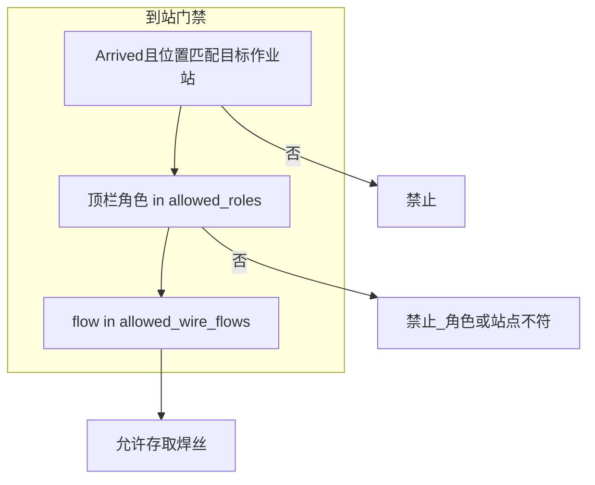

# 0.1 站点配置（多作业站 + 单充电点）

## 1. 站点类型

| 类型 | 配置 | 数量（0.1） |
|------|------|-------------|
| **作业站** | `work_stations[]` | **多个**；每站 `allowed_roles` 限定 OP 或 MH（或二者，不推荐混站） |
| **充电点** | `charge_station`（单对象） | **仅 1 个** |

充后：`return_to_last_work_station`（回到去充电前所在作业站，无驻点）。

复制 [`stations.template.yaml`](stations.template.yaml) → `stations.yaml` 后填写各站 `rcs_destination`。

---

## 2. 作业站与角色、流程

每个作业站声明：

| 字段 | 含义 |
|------|------|
| `allowed_roles` | `OP` / `MH`；触控屏当前顶栏角色须命中，否则本站存取 flow 不可用 |
| `allowed_wire_flows` | 该站允许的存取 flow（与角色一致） |
| `cabinet_id` | 绑定的发货柜（一车一柜时，不同站可不同柜） |
| `cabinet_maintenance_flows` | MH 格口维护（通常只配在 **MH 作业站**） |

**0.1 推荐映射**（与模板示例一致）：

| 作业站 | 角色 | 存取 flow |
|--------|------|-----------|
| 物料间焊丝柜 | **仅 MH** | `material_handler_load_available_wire` |
| 线边焊丝柜 | **仅 OP** | `operator_return_wire_and_issue_available_wire` |

| flow_id | 到站 | 角色+站点 |
|---------|------|-----------|
| `material_handler_load_available_wire` | 须到 **MH 作业站** | 顶栏 MH + `allowed_roles` 含 MH |
| `operator_return_wire_and_issue_available_wire` | 须到 **OP 作业站** | 顶栏 OP + `allowed_roles` 含 OP |
| `material_handler_open_*` | 不校验 RCS 到站 | 建议仅在 MH 站对应柜执行 |

---

## 3. 「到站门禁」是什么意思？

**到站门禁** = 存取焊丝前的 **两道检查**（应用层，非 RCS API）：

```text
① 车已到站：Arrived 且 currentPosition == 目标作业站的 rcs_destination
② 角色与站点匹配：顶栏 OP/MH 属于该站 allowed_roles，且要开的 flow 在该站 allowed_wire_flows 中
③ 非 Moving / 非充电中
```

| 场景 | 结果 |
|------|------|
| 车在 OP 站、角色 OP、打开存废取新 | 允许 |
| 车在 OP 站、角色 MH、打开存料 | **拒绝**（「本站仅支持操作员」或引导去 MH 站） |
| 车在 MH 站、角色 OP | **拒绝** |
| 车未到任一目标站 | **拒绝**（「请先移动至 {站名}」） |

**MH 格口维护**仍不校验 RCS 到站（§3.3），但应使用对应 `cabinet_id` 的柜。



---

## 4. 充电点（唯一）

- 配置节为 **`charge_station`**（单数），0.1 只保留一条。
- 低电量 → `CreateChargeOrderAsync(charge_station.rcs_destination)`。
- 充满 → `CreateMoveOrderAsync(上一作业站的 rcs_destination)`；上一站可以是 MH 站或 OP 站，按离站前记录。

---

## 5. 与 appsettings / UI

| 项 | 说明 |
|----|------|
| `charge_station.rcs_destination` | `AgvDispatch:ChargeDestination` |
| `ui.move_targets` | 手动控车下拉：所有 enabled 作业站 |
| `ui.default_move_target_by_role` | 切 OP/MH 标签时默认建议目标站 |
| 顶栏 OP/MH | 与 `WireDispenser.Demo` 一致；门禁用当前角色匹配 `allowed_roles` |

SDK 不读 YAML；宿主加载 `stations.yaml` 后实现门禁与回充。

---

## 6. 验收检查

- [ ] 至少 1 个 MH 专用作业站 + 1 个 OP 专用作业站已启用且 RCS 号正确
- [ ] 仅 1 个 `charge_station`
- [ ] 车在 OP 站、MH 角色时无法做 OP 存取（反之亦然）
- [ ] 脚本 4：充后回到充点前记录的作业站（MH 或 OP 站均可）
