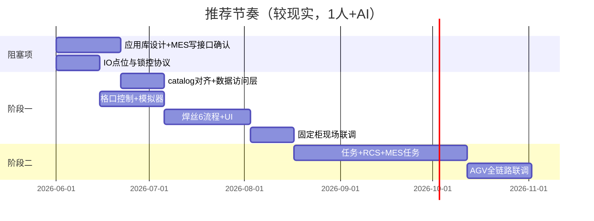

结合你仓库里的现状，下面是一份**偏现实的工期估算**（配合 Cursor/AI 辅助开发，默认 **1 名能写 C#/WPF + 数据库 + 现场联调的全栈**，MES/硬件/RCS 有人配合；若只有你一人且还要跑协调，周期要往上加）。

---

## 当前项目基线（影响工期的关键事实）

| 已有 | 缺口 |
|------|------|
| 6 条焊丝流程图（OP 主流程 + MH 存料 + 4 种开门） | `flow-sql-map` 与 `mes-sql-catalog` **ID 未对齐**（如 `mes.wire_lot.get_type_by_lot_no` vs catalog 里实际条目） |
| `mes-sql-catalog` 约 **6 条 MES SQL**（4 条 verified，配额/退料为 **draft**） | **应用库 SQL 未入 catalog**（柜内焊丝、归还重量、领用提交等） |
| `mes-schema` 仅部分表 | `待补充需求清单.md` 里 MES 字段、IO 点位、退料参数等大量 **待现场确认** |
| `WireDispenser.Demo` 仅有 MH/OP **界面壳子**，无业务逻辑 | `AuxiLink` 几乎空壳；**无格口/Modbus 控制代码** |
| 多层需求文档（任务、RCS、流程模板等）写得很全 | 属于**全系统一期**，不是“焊丝+固定柜”子集 |

结论：**设计和文档骨架不错，但“能稳定写代码”的契约（应用库 + MES 写接口 + 硬件点位）还没闭环**，这会直接吃掉 2～4 周，且很难靠 AI 省掉。

---

## 阶段一：焊丝存取/发放 + 界面 + 实际控制发货柜（**不含** AGV 移动与任务调度）

这里指：柜体**固定在工位**（或你手动当“已到站”），把 6 条流程跑通，真开锁/关锁/更新应用库、调 MES。

### 必须先做的“设计/确认”（并行，但会挡开发）

| 事项 | 人工/协调 | 有 AI 的开发侧 |
|------|-----------|----------------|
| 应用库表结构（格口、在柜焊丝、门状态、归还重量、操作日志） | 1～2 周评审 | AI 可出草案，**定稿仍要人** |
| MES 写操作：`submit_return`、领用、`check_quota` 入参含义 | **1～3 周**（看 MES 响应速度） | AI 不能代替确认 |
| 锁控板协议 + IO 点位表 | **1～2 周**（电气/硬件） | — |
| 补齐 catalog + 对齐 flow-sql-map | — | 约 3～5 天 |

**设计未清前，不建议大规模写业务代码**，否则退料/领用联调会返工。

### 开发拆解（设计基本就绪之后）

| 模块 | 内容 | 工期（1 人 + AI） |
|------|------|-------------------|
| 数据与访问层 | 应用库 + MES 仓储；按 YAML 生成/维护 SQL 封装 | 1.5～2.5 周 |
| 格口控制层 | Modbus TCP（或现场协议）、开锁脉冲、状态读、模拟器 | 2～3.5 周 |
| 流程引擎 | 6 条流程的状态机（不必上一期“流程模板引擎”，焊丝可先写死配置） | 2.5～4 周 |
| 界面 | 在 Demo 上接 VM、格口图、提示语、异常分支 | 1.5～2.5 周 |
| 联调与验收 | MES 测试库、真柜、异常场景（配额失败、无匹配焊丝等） | 2～3 周 |

### 阶段一总工期（从“今天”到“产线可试运行”）

| 场景 | 日历时间 | 说明 |
|------|----------|------|
| **乐观** | **10～12 周** | MES/硬件 2 周内定稿；你熟悉 Modbus；只做焊丝必需校验 |
| **较现实** | **14～18 周** | 含 2～4 周设计/确认；catalog 返工 1 次；现场联调 2 轮 |
| **偏悲观** | **20～24 周** | MES 写接口反复改、锁控不稳定、应用库规则现场才说清楚 |

**AI 能省的大致 25%～35%**：DTO/仓储/UI 绑定、按 `mes-sql-catalog` 生成调用骨架、单测与日志样板。  
**AI 省不了**：MES 口径、退料函数返回值、锁反馈时序、现场误开门/误配线。

### 可砍范围的“最小可跑通”（约 8～10 周，仍要先定应用库 + 核心 MES）

若接受分期上线：

1. **MH 存焊丝** + **OP 存废取新**（两条主流程）  
2. 格口控制 + 应用库格口状态  
3. MH “打开指定仓门/有料仓门”延后  
4. 配额/退料若 MES 未确认，可先做**只读校验 + 人工放行**占位（文档里已有类似分支）

---

## 阶段二：在阶段一基础上 + 机器人移动 + 任务管理（RCS + MES 任务 + 状态机）

对应 `requirements/复合机器人发货柜需求规格说明书.md` 里的一期：**MES 轮询任务、RCS HTTP、任务状态机、到站后再做装/取货、移动前格口关闭联锁、有限流程模板**等。这是在“焊丝业务”之上又加一整层平台。

| 模块 | 工期（在阶段一完成后，1 人 + AI） |
|------|----------------------------------|
| 基础数据（站点、柜、格口、物料/模板映射） | 2～3 周 |
| 任务管理层（创建、状态机、与 MES/人工任务） | 3～4 周 |
| RCS 协同（下发站点、轮询到站、超时/异常） | 2～3.5 周 |
| MES 任务接口（与现有焊丝 SQL **另一套**契约） | 2～4 周 |
| 流程模板（有限配置项，非自由编排） | 2～3 周 |
| 移动联锁 + 与焊丝流程衔接 | 2～3 周 |
| 带 AGV 的全链路联调 | 2～4 周 |

| 场景 | 在阶段一之后的增量 | 端到端累计（从项目启动算） |
|------|-------------------|---------------------------|
| 乐观 | +12～14 周 | ~22～26 周 |
| 较现实 | +16～20 周 | ~30～38 周 |
| 悲观 | +24～28 周 | ~38～46 周 |

**阶段二对 RCS/MES 任务接口的依赖比阶段一更重**；RCS 文档不齐时，往往比写代码更耗时。

---

## 建议的时间线（配合 AI 的执行顺序）

---

## 对你当前状态的直接建议

1. **先别估“写代码”**，先把三块定成“可编码契约”（各 1 份定稿即可）：  
   - 应用库 ER + 格口/在柜焊丝状态机  
   - MES：退料 `FUN_MAT_TRANS_NEW`、配额 `Get_Mat_QuotaCheck`、**领用**接口字段  
   - 硬件：每格口开锁/锁状态/（可选）物体检测点位  

2. **用 1～2 周** 把 `mes-sql-catalog` 与 `flow-sql-map` 对齐，并补全 `app.*` SQL；AI 最适合干这块，能明显减少后面流程实现的返工。

3. **阶段一验收标准**建议写死：OP 全流程 + MH 存焊丝 + 真开锁 + MES 退料/领用成功回写 + 应用库格口状态一致；其余 MH 开门流程可二期。

4. 若团队能加到 **2 人**（应用 + 硬件/联调分工），阶段一常能压到 **10～12 周**；阶段二也常能少 **4～6 周**。

---

## 一句话结论

| 目标 | 较现实工期（1 人 + AI，含设计/联调） |
|------|-------------------------------------|
| **焊丝流程 + UI + 真控柜（柜固定）** | **约 3.5～4.5 个月**（设计若拖后腿则 **5～6 个月**） |
| **再 + 移动 + 任务管理（完整一期平台）** | 在上一段基础上 **再加约 4～5 个月**，合计约 **7～9 个月** |

你提到“MES 交互和应用库基本设计还没完成”——这通常意味着阶段一里至少有 **3～5 周** 不能算有效开发进度，应单独排进计划，而不是算进“编码周数”。

如果你愿意补充三点：**是否只有你开发、MES/硬件谁对接、柜是否必须一期就上 AGV**，我可以把上表收成一张更贴你现场的「周计划表」（按周拆任务）。